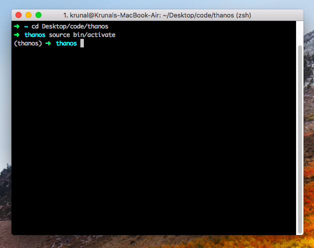
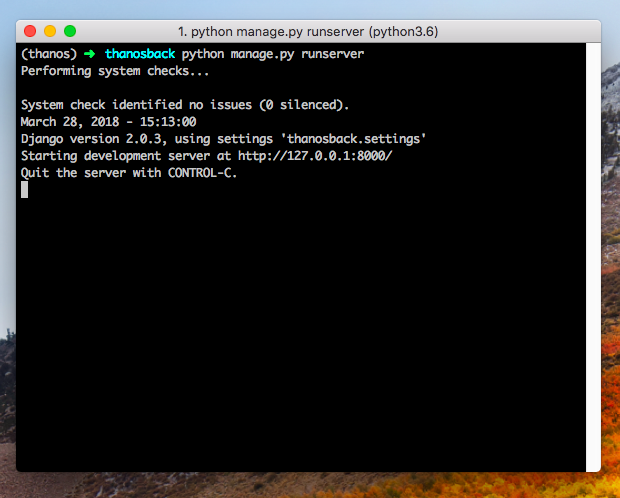
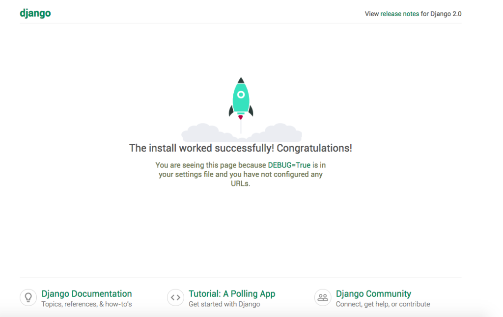
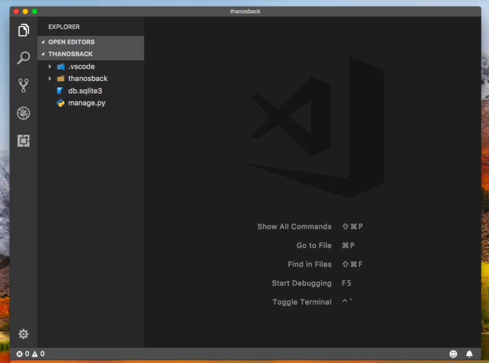

# Mac端安装Django

**Advantages of Django Framework**

- Ridiculously fast.
- Reassuringly secure.
- Exceedingly scalable.
- Incredibly versatile.
- Fully loaded.

**Step 1: Install Python on Mac.**

Python is already installed on brand new Mac, but its version is old. So what we do is to install the latest version of python using **homebrew**

```
brew install python3
```

After it will complete the installation, you will type the following command to check the version. First type **python3** in your terminal. Since **MacOS X** has already python installed, we cannot uninstall the old version because otherwise the Python 2 supported programmes will be stopped and we need to reinstall the mac. So we need to type python3 instead of **python.**

```
python3
```

It will display the version, and now we can execute the python code. 

Okay, so we have successfully installed the **python 3**. Now, to out from the python console, we need to type **exit().**

**Step 2: Install Pip package management system.**

**Pip** is the package management system used to install and manage software packages written in **Python**. Now, install it using the following command.

```
sudo easy_install pip
```

**Step 3: Install virtualenv for python.**

Now, type this command in your terminal.

```
pip3 install virtualenv
```

Okay, after installing, we need to create the **virtual environment**. Now you will create this folder when you are putting your other projects. Mine is **desktop >> code** folder. So navigate to that and type the following command. In my case, My virtualenv folder name is **thanos**

```
virtualenv thanos
```

Okay, so it will install the required folders. Now, go into that folder.

```
cd thanos
```

Now, activate the virtual environment by typing the following command. Please Make sure you are in the virtual environment directory.

```
source bin/activate
```

You will see your terminal looks like below.



So, our virtual environment has been started. Now, this is the time to install the **Django Framework**.

**Step 4: Install Django In Mac**

Okay, now stay in that folder and install Django using the following command.

```
pip3 install django
```

It will download the Django project. Check the Django version using the following command.

```
python3 -m django --version
```

In our case, we have explicitly defined that we are installing 2.1.7. So it will display that version.

**Step 5: Create the Django Project.**

We need to install skeleton of the Django project. So type the following command.

```
django-admin startproject thanosback
```

Here, our project name is **thanosback**. Next, go into that folder.

```
cd thanosback
```

Finally, we have created the project. Now start the project server by typing the following command.

```
python manage.py runserver
```



遇到报错：

```
You have 15 unapplied migration(s). Your project may not work properly until you apply the migrations for app(s): admin, auth, contenttypes, sessions.
Run 'python manage.py migrate' to apply them.
```

执行`python manage.py migrate`即可修复。

It has started the development server, and we can access it via [localhost:8000](http://localhost:8000/)

Navigate to the browser, and you will see the screen like this.



**Step 6: Open Django on Visual Studio Code.**

This step is optional because if you are using **Visual Studio Code**, then it will be helpful to you. If you are using another IDE like **pycharm** or editor like **sublime text**, then you can skip this step. First, perform the following step.

Install the Python extension

Now, open our project in the visual studio code using the following command.

```
code .
```

Please make sure, you are at the root of the **thanosback** folder.

You will get the folder structure like this.



Finally, **How To Install Django In Mac** tutorial is over. 

其他参考资料：<https://www.jianshu.com/p/5632f0f99f7f>

I just want to test if GitHub can show the changes that i made to this document in a clear way.