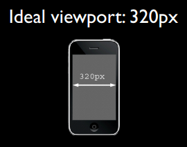
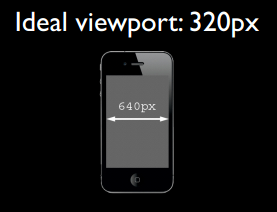
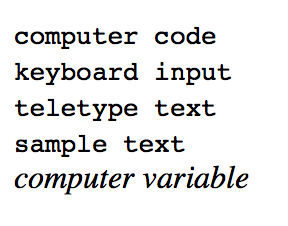
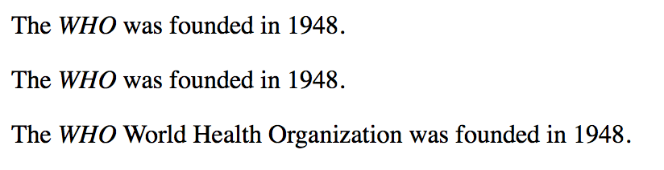

# HTML

## HTML概述

HTML 是用来描述网页的一种语言。HTML 指的是超文本标记语言 (**H**yper **T**ext **M**arkup **L**anguage)。

HTML 不是一种编程语言，而是一种标记语言(markup language)，标记语言是一套标记标签(markup tag)，HTML 使用标记标签来描述网页。

## HTML标签

HTML 标记标签通常被称为 HTML 标签 (HTML tag)，是由尖括号包围的关键词，通常成对出现，比如 \<b> 和\</b>。标签对中的第一个标签是开始标签（开放标签），第二个标签是结束标签（闭合标签）。

**HTML文档=网页**

```
<html>
<body>

<h1>一个标题</h1>

<p>一个段落</p>

</body>
</html>
```

\<html>\</html>之间的内容描述网页

\<body>\</body>之间文本是可见的页面内容

标题（Heading）通过\<h1>-\<h6>定义。

```
<h1>标题一</h1>
<h2>标题二</h2>
<h3>标题三</h3>
```

段落：

\<p>是块级元素

```
<p>段落内容</p>
```

链接：

```
<a href="http://pku.edu.cn">北大官网</a>
```

图像：

```

```

图像的名称和尺寸为属性形式。


**其他常用标签**：

水平线：

用于分隔内容

```
<p>我是段落1</p>

<hr />

<p>我是段落2</p>
```

注释：

```
<!--我是注释-->
```

换行：

```
<p>这是<br />一个带换行<br />的段落</p>
```

\<meta>标签：

\<meta>元素提供有关页面的元信息，比如针对搜索引擎和更新频度的描述和关键词。位于文档的头部，不包含任何内容。\<meta>标签的属性定义了与文档相关联的名称/值对。

必需的属性：

|  属性   |    值     |                    描述                    |
| :-----: | :-------: | :----------------------------------------: |
| content | some_text | 定义与 http-equiv 或 name 属性相关的元信息 |

可选的属性：

|    属性    |                              值                              |                          描述                           |
| :--------: | :----------------------------------------------------------: | :-----------------------------------------------------: |
| http-equiv |     content<br>type<br>expires<br>refresh<br>set-cookie      |            把 content 属性关联到 HTTP 头部。            |
|    name    | author<br>description<br>keywords<br>generator<br>revised<br>others | 把 content 属性关联到一个名称，可自由选取有意义的名称。 |
|   scheme   |                          some_text                           |           定义用于翻译 content 属性值的格式。           |

name属性

keywords: 为文档定义一组关键字，某些搜索引擎在遇到这些关键字时，会用这些关键字对文档进行分类。

```
<meta name="keywords" content="HTML,ASP,PHP,SQL">
```


```
<meta name="viewport" content="width=device-width,initial-scale=1.0">
```

场景：移动设备默认viewpoint是layout viewpoint（比屏幕要宽），但是进行移动设备网站的开发时，需要ideal viewpoint。

该meta标签作用：让当前viewpoint的宽度等于移动设备的宽度，同时不允许用户手动缩放，否则就会出现横向滚动条。


<center><em>layout viewpoint</em></center>


<center><em>visual viewpoint</em></center>

***ideal viewpoint***

1. 不需要用户缩放和横向滚动就能正常查看网站所有内容
2. 显示合适的文字大小

理想情况：一段14px的文字、图片无论是在何种密度屏幕，何种分辨率下，显示出来的大小都差不多。ideal viewport没有一个固定的尺寸，不同的设备各不相同。所有的iphone的ideal viewport宽度都是320px，无论屏幕宽度是320还是640，也就是说，在iphone中，css中的320px就代表iphone屏幕的宽度。






**content属性值：**

width：设置layout viewpoint的宽度，为正整数或字符串“device-width”。

height：设置layout viewpoint的高度，此属性不重要，很少使用。

Initial-scale：设置页面的初始缩放值，可以带小数。取值1.0代表页面按实际尺寸显示，无任何缩放。

minimum-scale/maximum-scale：允许用户的最小/最大缩放值

user-scalable：是否允许用户进行缩放，yes/no：允许/禁止。


**区别div/section/article:**

div：

- 定义：文档中的分区或节(division)
- 使用：作为布局以及样式化时使用（此时三者并无区别，但div更常用）
- 提示：\<div>是一个*块级元素*，浏览器通常会在div前后放置一个换行符。


section：

- 定义：文档中的节，一般带有标题。

- ```
  <section>
  	<h1>我是标题</h1>
  	<p>我是段落</p>
  </section>
  ```

- 使用场合：文章的章节、标签对话框中的标签页或者论文中带有编号的部分。

- 提示：section不仅仅是一个普通的容器标签，这区别于div标签（仅为了样式化或方便脚本使用）。一般来说，当元素内容明确出现在*文档大纲*中时，section就是适用的。


article：

- 定义：独立的自包含内容。一般来说，article会有标题部分（包含在header内），有时会包含footer。
- 使用场合：一段内容脱离了所在语境，仍是完整独立的，如博客中一篇文章，论坛中的一篇帖子等，就用article。
- 提示：虽然section也是带有主题性的一块内容，但是article本身，无论从结构还是内容上都是独立完整的。


**Note：**

无法通过在HTML里中添加额外的空格或换行来改变输出的效果，显示页面时，浏览器会移除源代码中多余的空格和空行。

# HTML元素

HTML 元素指的是从开始标签（start tag）到结束标签（end tag）的所有代码。


**语法：**

- 没有内容的HTML元素称为空元素，如\<br>（定义换行），在开始标签中添加斜杠，比如\<br />，是关闭空元素的正确方法，HTML、XHTML 和 XML 都接受这种方式。
- HTML 标签对大小写不敏感：\<P> 等同于\<p>。许多网站都使用大写的 HTML 标签。万维网联盟（W3C）在 HTML 4 中*推荐*使用小写，而在未来 (X)HTML 版本中*强制*使用小写。

# HTML属性

- HTML 属性提供了有关 HTML 元素更多的信息。属性总是以名称/值对的形式出现，如：name="value"。
- 属性总是在开始标签中规定，且始终被包括在括号内，双引号最为常见，单引号亦可，若属性值本身含有双引号，则必须使用单引号。
- 属性和属性值对大小写*不敏感*，不过，万维网联盟在其 HTML 4 推荐标准中推荐小写的属性/属性值，且新版本的 (X)HTML 要求使用小写属性。

**Note：**

不建议使用以下标签和属性，因为之后的HTML版本和XHTML中将不再支持。

| 标签                   | 描述               |
| :--------------------- | ------------------ |
| \<center>              | 定义居中的内容。   |
| \<font> 和 \<basefont> | 定义 HTML 字体。   |
| \<s> 和 \<strike>      | 定义删除线文本     |
| \<u>                   | 定义下划线文本     |
| **属性**               | **描述**           |
| align                  | 定义文本的对齐方式 |
| bgcolor                | 定义背景颜色       |
| color                  | 定义文本颜色       |

# HTML样式

style属性：一种改变所有HTML元素的样式的通用方法。通过HTML样式，能够通过使用style属性直接将样式添加到HTML元素，或者在独立样式表中（CSS文件）进行定义。

**实例-背景颜色**

```
<html>

<body style="background-color:yellow">
<h2 style="background-color:red">我是标题</h2>
<p style="background-color:green">我是段落</p>
</body>

</html>
```

淘汰了旧的bgcolor属性


**实例-字体、颜色、尺寸**

```
<html>

<body>
<h1 style="font-family:verdana">我是标题</h1>
<p style="font-family:arial;color:red;font-size:20px;">我是段落</p>
</body>

</html>
```

淘汰了旧的font标签


**实例-文本对齐**

```
<html>

<body>
<h1 style="text-align:center">我是标题</h1>
<p>上面的标题相对于页面居中对齐。</p>
</body>

</html>
```

淘汰了旧的align属性


# HTML格式化

**文本格式化：**

```
<html>
<body>

<b>This text is bold</b>
<!--粗体-->

<strong>This text is strong</strong>
<!--强调-->

<big>This text is big</big>
<!--大号字体-->

<em>This text is emphasized</em>
<!--强调-->

<i>This text is italic</i>
<!--斜体-->

<small>This text is small</small>
<!--小号字体-->

This text contains
<sub>subscript</sub>
<!--下标-->

This text contains
<sup>superscript</sup>
<!--上标-->

</body>
</html>
```

**预格式文本**：用pre标签控制空行和空格，适合显示计算机代码。

**”计算机输出“标签：**常用于显示计算机/编程代码

```
<code>computer code计算机代码</code>
<kbd>keyboard input键盘码</kbd>
<tt>teletype text打字机代码</tt>
<samp>sample text计算机代码样本</samp>
<var>computer variable变量</var>
```



**地址：**

```
<address>
Written by <a href="mailto:webmaster@example.com">Donald Duck</a>.<br> 
Visit us at:<br>
Example.com<br>
Box 564, Disneyland<br>
USA
</address>
```

**缩写和首字母缩写：**

```
<abbr title="etcetera">etc.</abbr>
<acronym title="World Wide Web">WWW</acronym>
<!--某些浏览器中，将鼠标移至缩略词上时，title可用于展示表达的完整版，仅对IE5中的acronym元素有效。对于Netscape6.2中的abbr和acronym都有效。-->
```

**文字方向：**双向重写

bi-directional override(bdo)双流向覆盖

```
<bdo dir="rtl">
我喜欢你，就像你妈打你，不讲道理。
</bdo>
```

效果：

```
。理道讲不，你打妈你像就，你欢喜我
```

**块引用：**

```
引自鲁迅：
<blockquote>
这是长的引用。浏览器会插入换行和外边距。
</blockquote>

鲁迅说：
<q>
这是短的引用。前后有双引号，但不呈现特殊格式。
</q>
```

**删除字效果和插入字效果：**

```
<p>一打有<del>二十</del><ins>十二</ins>个。</p>
<!--大多数浏览器会改为删除文本和下划线文本，一些老式浏览器显示为普通文本。-->
```

# HTML引用

```
1.<q> 
<p>我的心愿是：<q>世界和平。</q></p>

2. <blockquote>
<p>以下内容可能引起不适：</p>
<blockquote cite="http://homework.html">
作业一：
作业二：
</blockquote>

3.<abbr> 
<p><abbr title="World Health Organization">WHO</abbr></p>

4. <dfn>：定义项目或缩写的定义

如果设置了<dfn>元素的title属性，则定义项目：
<p>The <dfn title="World Health Organization">WHO</dfn> was founded in 1948.</p>

如果<dfn>元素包含具有标题的<abbr>元素，则title定义项目：
<p>The <dfn><abbr title="World Health Organization">WHO</abbr></dfn> was founded in 1948.</p>
否则，<dfn>文本内容即是项目，并且父元素包含定义。
<p>The <dfn>WHO</dfn> World Health Organization was founded in 1948.</p>
```

效果：



```
5. <address>
<address>
Written by Julie.<br> 
Visit us at:<br>
pkuzjl.cn<br>
Beijing<br>
China
</address>
6. <cite>定义著作的标题
<p><cite>The three-body problem</cite> by Cixin Liu</p>
7. <bdo>
<bdo dir="rtl">i miss u</bdo>
```

# HTML表格

| 序号 | 元素                    | 意义                                                |
| ---- | ----------------------- | --------------------------------------------------- |
| 1    | `<table></table>`       | 定义整个表格                                        |
| 2    | `<tr></tr>`             | 一行                                                |
| 3    | `<td></td>`             | 一个单元格                                          |
| 4    | `<th></th>`             | 表头，一般会显示为粗体居中                          |
| 5    | `<caption></caption>`   | 表格标题                                            |
| 6    | `<thead></thead>`       | 定义表格的页眉（第一行）                            |
| 7    | `<tfoot></tfoot>`       | 定义表格页脚（最后一行）                            |
| 8    | `<tbody></tbody>`       | 定义表格主体，即掐头去尾的中间部分，常和6.7同时出现 |
| 9    | `<col></col>`           | 用于定义表格列的组，不在表格中显示                  |
| 10   | `<colgroup></colgroup>` | 定义表格列的属性                                    |

# HTML表单


# CSS

## CSS概述

**定义**：CSS 指层叠样式表 (Cascading Style Sheets)。样式定义如何显示 HTML 元素，样式是为了解决内容和表现分离的问题，通常存储在样式表中，多个样式定义可层叠为一。

1. 外部样式表：样式需要被应用到很多页面

```
<head>
<link rel="stylesheet" type="text/css" href="mystyle.css">
</head>
```

2. 内部样式表：单个文件需要特别样式

```
<head>
<style type="text/css">
body {background-color:red}
p {margin-left:20px}
</style>
</head>
```

3. 内联样式表：特殊的样式需要应用到个别元素

```
<p style="color:red;margin-left:20px">
我是段落。
</p>
```

层叠次序：

1. 内联样式（在 HTML 元素内部）——**最高优先权**
2. 内部样式表（位于 <head> 标签内部）
3. 外部样式表
4. 浏览器缺省设置


**语法：**

构成：选择器+一条或多条声明selector{declaration1;declaration2;...declarationN}

选择器：需要改变样式的HTML元素

声明：属性+值（属性：设置的样式属性style attribute）

```
selector{property:value}
```

例：将h1元素内文字定义为红色，字体大小设置为14像素。

```
h1{color:red;font-size:14px;}
```


**值的不同写法和单位：**

- 使用十六进制颜色值、RGB值：

p{color:#ff0000;}——red

p{color:rgb(255,0,0);}

p{color:rgb(100%,0%,0%);}

- 使用缩写：

p{color:#f00;}

**Note:** 

1. 使用RGB百分比时，值为0也要写百分比符号，但尺寸为0像素则不需要加px单位。
2. 值为若干单词，需要加引号。

```
p{font-family:"sans serif";}
```

3. 多重声明之间用分号分隔，最后的声明末尾可不加分号，但此举好处在于增减声明时可减少出错可能性。
4. 每行只描述一个属性可增强定义的可读性。
5. 多重声明和空格的使用使得样式表更容易编辑
6. CSS对大小写不敏感，但是与HTML一起工作时，class和id名称对大小写是敏感的。


**高级语法：**

# 样式化文字

# 样式化区块

# CSS排版概述


# 部署云服务器踩过的坑——使用指南

- ubuntu server16.01.1 LTS 64位 Apache
- Centos7.5 64 Nginx


**要求：**撰写个人web页面介绍并且可随时访问

**原理：**首先把html文件放在一个有公网IP的服务器上，才能通过域名/IP地址把HTTP请求送到正确的服务器上。除此之外，还需要知道是哪个应用程序才能正确地把信息送到并获取信息。我们通过HTTP协议来访问（默认是80端口），还需要一个服务器来监听80端口，从而在收到静态资源请求时返回相应的页面。

**步骤：**

1. 一台具有公网Ip地址的服务器（云主机——CPU 内存 ip地址等）
2. 装windows/linux操作系统
3. 写index.html文件（用index就不用在ip地址后面+文件名）
4. 文件上传服务器
5. 安装web服务器——服务器软件（微软自带服务器iis），配置工作目录（主目录），文件放入工作目录。
6. 通过浏览器访问`http://ip地址/文件名`

web服务器：其他人访问服务器就会定位到工作目录。


## 购买

首先在腾讯云上购买云服务器，安装Centos7.5 64位系统，主机类型：标准型S4，配置1核1GB1Mbps，按流量计费。


## Nginx配置静态服务器

Nginx是一个Web服务器，相⽐Apache，内存占⽤少，稳定性好。当后期当前主机上有多个Web服务器时，还可⽤作反向代理。

```
# 登录云服务器
# 1.浏览器WebShell方式登录
ssh root@ip地址/域名
# 2.使用Mac OS X系统：打开Mac终端输入
ssh -q -l root -p 22 ip地址/域名
# 输入CVM实例密码进行登录

# pwd之后可以看到目前在/root目录
pwd

# 安装Nginx
# yum是软件包管理器，下载安装并处理好依赖关系
sudo yum install yum-utils

# 进入/etc/yum.repos.d/
cd /etc/yum.repo.d/

# 新建nginx.repo
vi nginx.repo

# 内容
[nginx-stable]
name=nginx stable repo
baseurl=http://nginx.org/packages/centos/$releasever/$basearch/
gpgcheck=1
enabled=1
gpgkey=https://nginx.org/keys/nginx_signing.key

[nginx-mainline]
name=nginx mainline repo
baseurl=http://nginx.org/packages/mainline/centos/$releasever/$basearch/
gpgcheck=1
enabled=0
gpgkey=https://nginx.org/keys/nginx_signing.key

# esc 
# :wq 修改保存后安装
sudo yum install nginx
# 过程中会出现核实573B FD6B 3D8F BC64 1079 A6AB ABF5 BD82 7BD9 BF62 接受
# nginx依赖configuration文件工作，默认nginx.conf会出现在文件夹/usr/local/nginx/conf,/etc/nginx,或/usr/local/etc.nginx中，我这里是/etc/nginx里，然后开启nginx
nginx -c /etc/nginx/nginx.conf

# 浏览器输入购买的云服务器地址(公网IP)，即可看到nginx启动页面
# 查看nginx.conf文件内容(cat只能查看不能编辑)
cat /etc/nginx/nginx.conf
---------------------------------------
user nginx;
worker_processes 1;

error_log /var/log/nginx/error.log warn;
pid 	  /var/run/nginx.pid;


events {
	worker_connections 1024;
}


http {
	include /etc/nginx/mime.types;
	default_type application/octet-stream;
	log_format main '$remote_addr - $remote_user [$time_local] "$request" '
					'$status $body_bytes_sent "$http_referer" '
					'"$http_user_agent" "$http_x_forwarded_for"';
					
access_log /var/log/nginx/access.log main;

sendfile on;
#tcp_nopush on;

keepalive_timeout 65;

#gzip on;

include /etc/nginx/conf.d/*.conf;
}
--------------------------------------

# 可以看到很多细节配置，这里只需关注http{}内，include /etc/nginx/conf.d/*.conf;这里导入了这个文件，去看看。(vi可以查看和编辑)
vi /etc/nginx/conf.d/default.conf
# 对文件进行了修改，把对 / 的请求映射到我们存放html的目录上（即后面出现的scp命令，就会把本地文件放到/data/www里面。)
--------------------------------------
server{
	listen 80;
	server_name localhost;
	
	#charset koi8-r;
	#access_log /var/log/nginx/host.access.log main;
	
	#location / {
	#    root /usr/share/nginx/html;
	#    index index.html index.htm;
	#}
	
	location / {
	root /data/www;
	}
	
	#error_page 404 /404.html;
	
	# redirect server error pages to the static page /50x.html
	#

	error_page 500 502 503 504 /50x.html;
	location = /50x.html {
		root /usr/share/nginx/html;
	}

	# proxy the PHP scripts to Apache listening on 127.0.0.1:80
	#
	#location ~ \.php$ {
	# proxy_pass http://127.0.0.1;
	#}
	
	# pass the PHP scripts to FastCGI server listening on 127.0.0.1:9000
	#
	#location ~ \.php$ {
	# 	 root          html;
	# 	 fastcgi_pass  127.0.0.1:9000;
	# 	 fastcgi_index index.php;
	# 	 fastcgi_param SCRIPT_FILENAME /scripts$fastcgi_script_name;
	# 	 include 	   fastcgi_params;
	#}
	
	# deny access to .htaccess files, if Apache's document root
	# concurs with nginx's one
	#
	#location ~ /\.ht {
	# deny all;
	#}
}
------------------------------------
# 新建/data/www/目录
mkdir /data/www
# 新建一个shell，将写好的html文件上传到服务器(note:从mac本地上传而非ssh)
scp 本地html文件地址 云服务器放文件的地址
# 例：scp /Users/用户名/Desktop/index.html root@ip地址:/data/www/

# 不中断服务器重新加载配置文件
nginx -s reload
# 刷新浏览器即可看到个人介绍页面
```

**报错：**

无法上传本地html文件/No such file or directory：

```
# 检查目录权限（scp 虚拟用户）
# cd 你需要修改的目录
cd /data

# 查看文件的权限
ll
# drwxr-xr-x 2 root root 4096 3月   8 22:11 www
# 第一个字符代表文件（-）、目录（d）、链接（l），其余字符每三个一组。
  rwx 所有者（user）拥有的权限：读写执行
  r-x 组群（group）——与user同一组的用户——拥有的权限：读、执行不能写
  r-x 其他人（other）拥有的权限：读、执行不能写
  2：表示连接的文件数
  root：表示用户
  root：表示用户所在的组
  4096：文件大小
  3月 8 22：11：最后修改日期
  www：文件名
 
# 更改文件权限为rwx-rwx-rwx(777)
chmod -R 777 www
# 查看是否更改成功
ll

# 重启nginx
service nginx restart

# 检查端口占用
netstat -nap 
# 例：tcp	0	0 0.0.0.0:80	0.0.0.0:*	LISTEN	2336/nginx: master 
# 一个小技巧：netstat -nap | grep 80 迅速找到80端口

# 杀进程
# 例：kill 2336

# 清除浏览器缓存
# 重启nginx
service nginx restart
```

重启nginx丢失nginx.pid：

```
# 报错信息
nginx: [error] open() "/var/run/nginx.pid" failed (2: No such file or directory)
# 这是因为把nginx进程杀死后pid丢失了，下一次再开启Nginx -s reload无法启动，重装可以解决，但太麻烦。
# 解决办法：nginx -s reload is only used to tell a running nginx process to reload its config. After a stop, you don't have a running nginx process to send a signal to. Just run nginx (possibly with a -c /path/to/config/file)

nginx -c /etc/nginx/nginx.conf
```

最后附Nginx页面不能正常访问排除方法：https://blog.csdn.net/lizhongfu2013/article/details/79699641


ubuntu server16.01.1 LTS 64位 Apache

通过ftp上传之后，在命令行敲`sudo mv ~/h1/index.html /var/www/html`

