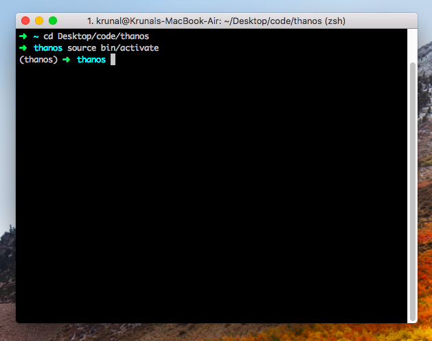
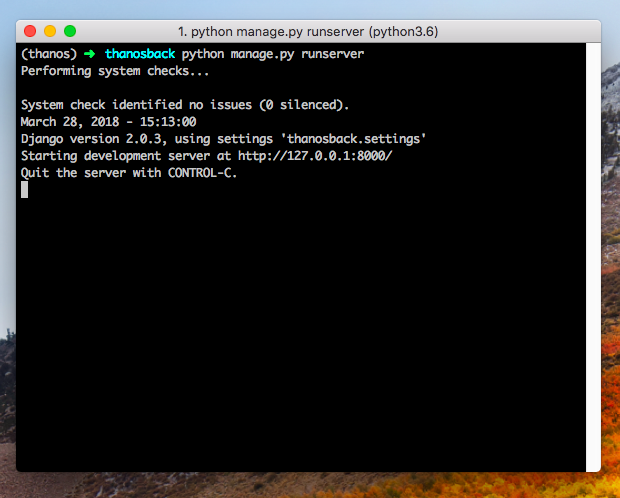
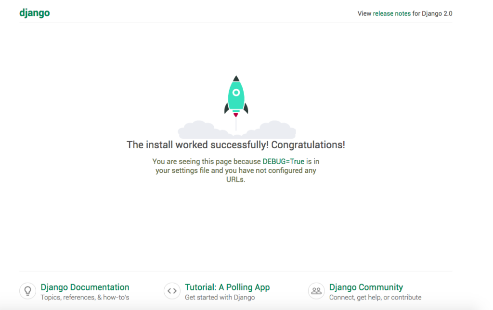
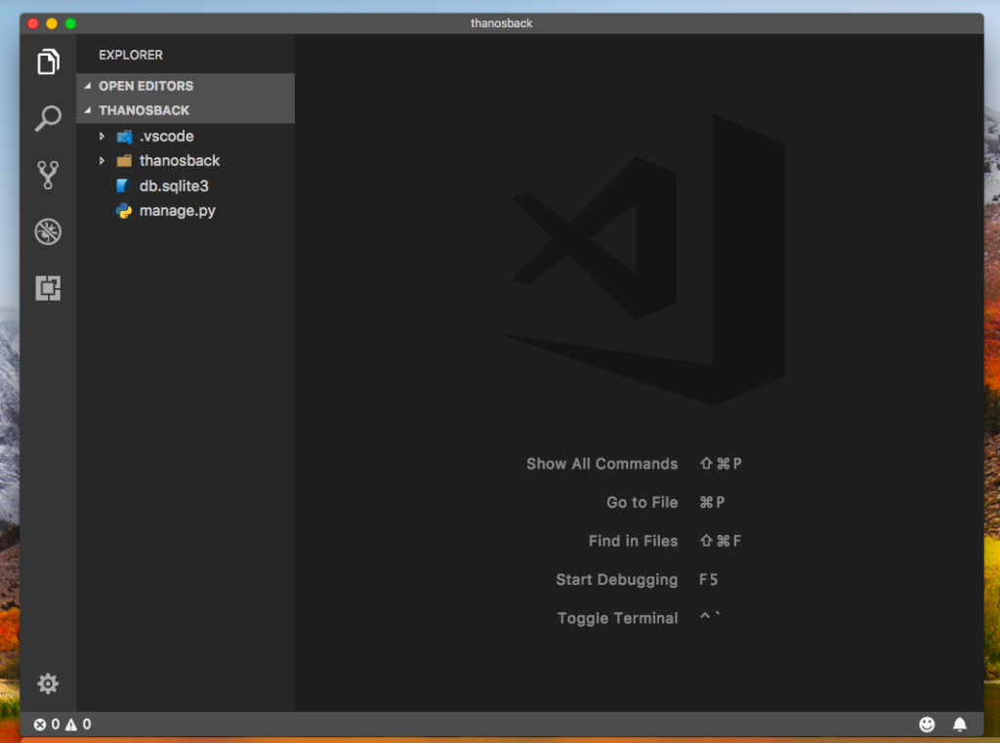

# HTML

## HTML概述

HTML 是用来描述网页的一种语言。HTML 指的是超文本标记语言 (**H**yper **T**ext **M**arkup **L**anguage)。

HTML 不是一种编程语言，而是一种标记语言(markup language)，标记语言是一套标记标签(markup tag)，HTML 使用标记标签来描述网页。

## HTML元素

HTML 元素指的是从开始标签（start tag）到结束标签（end tag）的所有代码。


**语法：**

- 没有内容的HTML元素称为空元素，如\<br>（定义换行）\，在开始标签中添加斜杠，比如\<br />，是关闭空元素的正确方法，HTML、XHTML 和 XML 都接受这种方式。
- HTML 标签对大小写不敏感：\<P> 等同于\<p>。许多网站都使用大写的 HTML 标签。万维网联盟（W3C）在 HTML 4 中*推荐*使用小写，而在未来 (X)HTML 版本中*强制*使用小写。

## HTML标签

HTML 标记标签通常被称为 HTML 标签 (HTML tag)，是由尖括号包围的关键词，通常成对出现，比如 \<b> 和\</b>。标签对中的第一个标签是开始标签（开放标签），第二个标签是结束标签（闭合标签）。

**HTML文档=网页**

```html
<!DOCTYPE html>
<html>
	<head>
		<meat charset="utf-8">
		<title>test</title>
	</head>
	<body>
		<h1>一个标题</h1>
		<p>一个段落</p>
	</body>
</html>
```

\<!DOCTYPE html>文档类型。

\<html>\</html>之间的内容描述网页，称为根元素。

\<head>\</head>不展现给用户，包含例如面向搜索引擎的搜索关键字、页面描述、CSS样式表和字符编码声明等。

\<meta charset="utf-8"> 当前文档使用 UTF-8 字符编码。

\<body>\</body>之间文本是可见的页面内容，可以是文本、图像、视频、游戏、可播放的音轨等。


标题（Heading）通过\<h1>-\<h6>定义，一般用到最多3-4级标题。

```html
<h1>标题一</h1>
<h2>标题二</h2>
<h3>标题三</h3>
```

段落：

\<p>是块级元素

```html
<p>段落内容</p>
```

列表：

标记列表通常包括至少两个元素。最常用的列表类型为：

1. 无序列表（Unordered List）中项目的顺序并不重要，就像购物列表。用一个\<ul>元素包围。
2. 有序列表（Ordered List）中项目的顺序很重要，就像烹调指南。用一个\<ol>元素包围。

列表的每个项目用一个列表项目（List Item）元素\<li>包围。

链接：

href=hypertext reference超文本引用

```html
<a href="http://pku.edu.cn">北大官网</a>
```

图像：

```html

```

`alt` :图像的描述内容，用于当图像不能被用户看见时显示，不可见的原因可能是：1. 用户有视觉障碍。视障用户可以使用屏幕阅读器来朗读 `alt` 属性的内容。2. 有些错误使图像无法显示。`alt` 属性的关键字即“描述文本”。

图像的名称和尺寸为属性形式。


**其他常用标签**：

水平线：用于分隔内容

```html
<p>我是段落1</p>

<hr />

<p>我是段落2</p>
```

注释：

```html
<!--我是注释-->
```

换行：

```html
<p>这是<br />一个带换行<br />的段落</p>
```

\<meta>标签：

\<meta>元素提供有关页面的元信息，比如针对搜索引擎和更新频度的描述和关键词。位于文档的头部，不包含任何内容。\<meta>标签的属性定义了与文档相关联的名称/值对。

必需的属性：

|  属性   |    值     |                    描述                    |
| :-----: | :-------: | :----------------------------------------: |
| content | some_text | 定义与 http-equiv 或 name 属性相关的元信息 |

可选的属性：

|    属性    |                              值                              |                          描述                           |
| :--------: | :----------------------------------------------------------: | :-----------------------------------------------------: |
| http-equiv |     content<br>type<br>expires<br>refresh<br>set-cookie      |            把 content 属性关联到 HTTP 头部。            |
|    name    | author<br>description<br>keywords<br>generator<br>revised<br>others | 把 content 属性关联到一个名称，可自由选取有意义的名称。 |
|   scheme   |                          some_text                           |           定义用于翻译 content 属性值的格式。           |

name属性

keywords: 为文档定义一组关键字，某些搜索引擎在遇到这些关键字时，会用这些关键字对文档进行分类。

```html
<meta name="keywords" content="HTML,ASP,PHP,SQL">
```


```html
<meta name="viewport" content="width=device-width,initial-scale=1.0">
```

场景：移动设备默认viewpoint是layout viewpoint（比屏幕要宽），但是进行移动设备网站的开发时，需要ideal viewpoint。

该meta标签作用：让当前viewpoint的宽度等于移动设备的宽度，同时不允许用户手动缩放，否则就会出现横向滚动条。


<center><em>layout viewpoint</em></center>


<center><em>visual viewpoint</em></center>

***ideal viewpoint***

1. 不需要用户缩放和横向滚动就能正常查看网站所有内容
2. 显示合适的文字大小

理想情况：一段14px的文字、图片无论是在何种密度屏幕，何种分辨率下，显示出来的大小都差不多。ideal viewport没有一个固定的尺寸，不同的设备各不相同。所有的iphone的ideal viewport宽度都是320px，无论屏幕宽度是320还是640，也就是说，在iphone中，css中的320px就代表iphone屏幕的宽度。


**content属性值：**

width：设置layout viewpoint的宽度，为正整数或字符串“device-width”。

height：设置layout viewpoint的高度，此属性不重要，很少使用。

Initial-scale：设置页面的初始缩放值，可以带小数。取值1.0代表页面按实际尺寸显示，无任何缩放。

minimum-scale/maximum-scale：允许用户的最小/最大缩放值

user-scalable：是否允许用户进行缩放，yes/no：允许/禁止。


**区别div/section/article:**

div：

- 定义：文档中的分区或节(division)
- 使用：作为布局以及样式化时使用（此时三者并无区别，但div更常用）
- 提示：\<div>是一个*块级元素*，浏览器通常会在div前后放置一个换行符。


section：

- 定义：文档中的节，一般带有标题。

- ```html
  <section>
  	<h1>我是标题</h1>
  	<p>我是段落</p>
  </section>
  ```

- 使用场合：文章的章节、标签对话框中的标签页或者论文中带有编号的部分。

- 提示：section不仅仅是一个普通的容器标签，这区别于div标签（仅为了样式化或方便脚本使用）。一般来说，当元素内容明确出现在*文档大纲*中时，section就是适用的。


article：

- 定义：独立的自包含内容。一般来说，article会有标题部分（包含在header内），有时会包含footer。
- 使用场合：一段内容脱离了所在语境，仍是完整独立的，如博客中一篇文章，论坛中的一篇帖子等，就用article。
- 提示：虽然section也是带有主题性的一块内容，但是article本身，无论从结构还是内容上都是独立完整的。


**Note：**

无法通过在HTML里中添加额外的空格或换行来改变输出的效果，显示页面时，浏览器会移除源代码中多余的空格和空行。


# HTML属性

- HTML 属性提供了有关 HTML 元素更多的信息。属性总是以名称/值对的形式出现，如：name="value"。
- 属性总是在开始标签中规定，且始终被包括在括号内，双引号最为常见，单引号亦可，若属性值本身含有双引号，则必须使用单引号。
- 属性和属性值对大小写*不敏感*，不过，万维网联盟在其 HTML 4 推荐标准中推荐小写的属性/属性值，且新版本的 (X)HTML 要求使用小写属性。

**Note：**

不建议使用以下标签和属性，因为之后的HTML版本和XHTML中将不再支持。

| 标签                   | 描述               |
| :--------------------- | ------------------ |
| \<center>              | 定义居中的内容。   |
| \<font> 和 \<basefont> | 定义 HTML 字体。   |
| \<s> 和 \<strike>      | 定义删除线文本     |
| \<u>                   | 定义下划线文本     |
| **属性**               | **描述**           |
| align                  | 定义文本的对齐方式 |
| bgcolor                | 定义背景颜色       |
| color                  | 定义文本颜色       |

# HTML样式

style属性：一种改变所有HTML元素的样式的通用方法。通过HTML样式，能够通过使用style属性直接将样式添加到HTML元素，或者在独立样式表中（CSS文件）进行定义。

**实例-背景颜色**

```html
<html>

<body style="background-color:yellow">
<h2 style="background-color:red">我是标题</h2>
<p style="background-color:green">我是段落</p>
</body>

</html>
```

淘汰了旧的bgcolor属性


**实例-字体、颜色、尺寸**

```html
<html>

<body>
<h1 style="font-family:verdana">我是标题</h1>
<p style="font-family:arial;color:red;font-size:20px;">我是段落</p>
</body>

</html>
```

淘汰了旧的font标签


**实例-文本对齐**

```html
<html>

<body>
<h1 style="text-align:center">我是标题</h1>
<p>上面的标题相对于页面居中对齐。</p>
</body>

</html>
```

淘汰了旧的align属性


# HTML格式化

**文本格式化：**

```html
<html>
<body>

<b>This text is bold</b>
<!--粗体-->

<strong>This text is strong</strong>
<!--强调-->

<big>This text is big</big>
<!--大号字体-->

<em>This text is emphasized</em>
<!--强调-->

<i>This text is italic</i>
<!--斜体-->

<small>This text is small</small>
<!--小号字体-->

This text contains
<sub>subscript</sub>
<!--下标-->

This text contains
<sup>superscript</sup>
<!--上标-->

</body>
</html>
```

**预格式文本**：用pre标签控制空行和空格，适合显示计算机代码。

**”计算机输出“标签：**常用于显示计算机/编程代码

```html
<code>computer code计算机代码</code>
<kbd>keyboard input键盘码</kbd>
<tt>teletype text打字机代码</tt>
<samp>sample text计算机代码样本</samp>
<var>computer variable变量</var>
```


**地址：**

```html
<address>
Written by <a href="mailto:webmaster@example.com">Donald Duck</a>.<br> 
Visit us at:<br>
Example.com<br>
Box 564, Disneyland<br>
USA
</address>
```

**缩写和首字母缩写：**

```html
<abbr title="etcetera">etc.</abbr>
<acronym title="World Wide Web">WWW</acronym>
<!--某些浏览器中，将鼠标移至缩略词上时，title可用于展示表达的完整版，仅对IE5中的acronym元素有效。对于Netscape6.2中的abbr和acronym都有效。-->
```

**文字方向：**双向重写

bi-directional override(bdo)双流向覆盖

```html
<bdo dir="rtl">
我喜欢你，就像你妈打你，不讲道理。
</bdo>
```

效果：

```
。理道讲不，你打妈你像就，你欢喜我
```

**块引用：**

```html
引自鲁迅：
<blockquote>
这是长的引用。浏览器会插入换行和外边距。
</blockquote>

鲁迅说：
<q>
这是短的引用。前后有双引号，但不呈现特殊格式。
</q>
```

**删除字效果和插入字效果：**

```html
<p>一打有<del>二十</del><ins>十二</ins>个。</p>
<!--大多数浏览器会改为删除文本和下划线文本，一些老式浏览器显示为普通文本。-->
```

# HTML引用

```html
1.<q> 
<p>我的心愿是：<q>世界和平。</q></p>

2. <blockquote>
<p>以下内容可能引起不适：</p>
<blockquote cite="http://homework.html">
作业一：
作业二：
</blockquote>

3.<abbr> 
<p><abbr title="World Health Organization">WHO</abbr></p>

4. <dfn>：定义项目或缩写的定义

如果设置了<dfn>元素的title属性，则定义项目：
<p>The <dfn title="World Health Organization">WHO</dfn> was founded in 1948.</p>

如果<dfn>元素包含具有标题的<abbr>元素，则title定义项目：
<p>The <dfn><abbr title="World Health Organization">WHO</abbr></dfn> was founded in 1948.</p>
否则，<dfn>文本内容即是项目，并且父元素包含定义。
<p>The <dfn>WHO</dfn> World Health Organization was founded in 1948.</p>
```

效果：


```html
5. <address>
<address>
Written by Julie.<br> 
Visit us at:<br>
pkuzjl.cn<br>
Beijing<br>
China
</address>
6. <cite>定义著作的标题
<p><cite>The three-body problem</cite> by Cixin Liu</p>
7. <bdo>
<bdo dir="rtl">i miss u</bdo>
```

# HTML表格

| 序号 | 元素                    | 意义                                                |
| ---- | ----------------------- | --------------------------------------------------- |
| 1    | `<table></table>`       | 定义整个表格                                        |
| 2    | `<tr></tr>`             | 一行                                                |
| 3    | `<td></td>`             | 一个单元格                                          |
| 4    | `<th></th>`             | 表头，一般会显示为粗体居中                          |
| 5    | `<caption></caption>`   | 表格标题                                            |
| 6    | `<thead></thead>`       | 定义表格的页眉（第一行）                            |
| 7    | `<tfoot></tfoot>`       | 定义表格页脚（最后一行）                            |
| 8    | `<tbody></tbody>`       | 定义表格主体，即掐头去尾的中间部分，常和6.7同时出现 |
| 9    | `<col></col>`           | 用于定义表格列的组，不在表格中显示                  |
| 10   | `<colgroup></colgroup>` | 定义表格列的属性                                    |

# HTML表单


# CSS

## CSS概述

**定义**：CSS 指层叠样式表 (Cascading Style Sheets)。样式定义如何显示 HTML 元素，样式是为了解决内容和表现分离的问题，通常存储在样式表中，多个样式定义可层叠为一。

1. 外部样式表：样式需要被应用到很多页面

```html
<head>
<link rel="stylesheet" type="text/css" href="mystyle.css">
</head>
```

2. 内部样式表：单个文件需要特别样式

```html
<head>
<style type="text/css">
body {background-color:red}
p {margin-left:20px}
</style>
</head>
```

3. 内联样式表：特殊的样式需要应用到个别元素

```html
<p style="color:red;margin-left:20px">
我是段落。
</p>
```

层叠次序：

1. 内联样式（在 HTML 元素内部）——**最高优先权**
2. 内部样式表（位于 <head> 标签内部）
3. 外部样式表
4. 浏览器缺省设置


## CSS语法


**构成：**选择器+一条或多条声明

```css
selector {
				 declaration1;
				 declaration2;
				 ...
				 declarationN；
}
```

**选择器：**需要改变样式的HTML元素

**声明：**一个单独的规则。使用美式拼写。

**声明块**：声明按块分组，每一组声明都用一对大括号包裹，每一个声明后必须用半角分号分隔。选择器加上声明块被称为**规则集**，通常简称**规则**。

Note：块有时候可以嵌套，这种情况下，每一对括号必须逻辑上嵌套，和嵌套HTML标签方式相同。

属性+值（属性：改变HTML元素样式的途径；属性和值都要区分大小写；用英文半角冒号隔开）

```css
selector {
				 property:value；
}
```

例：将h1元素内文字定义为红色，字体大小设置为14像素。

```css
h1 {
	 color: red;
	 font-size: 14px;
}
```

值的不同写法和单位：

- 使用十六进制颜色值、RGB值：

p{color:#ff0000;}——red

p{color:rgb(255,0,0);}

p{color:rgb(100%,0%,0%);}

- 使用缩写：

p{color:#f00;}

Note: 

1. 使用RGB百分比时，值为0也要写百分比符号，但尺寸为0像素则不需要加px单位。
2. 值为若干单词，需要加引号。

```
p {
	font-family: "sans serif";
}
```

3. 多重声明之间用分号分隔，最后的声明末尾可不加分号，但此举好处在于增减声明时可减少出错可能性。
4. 每行只描述一个属性可增强定义的可读性。
5. 多重声明和空格的使用使得样式表更容易编辑
6. CSS对大小写不敏感，但是与HTML一起工作时，class和id名称对大小写是敏感的。


**多元素选择：**选择多种类型元素添加一组相同的样式，选择器之间用逗号分隔。

```css
p, li, h1 {
  				color: red;
}
```


**不同类型的选择器：**

下面是一些常用的选择器类型：

| 选择器名称                           | 选择的内容                                                   | 示例                                                         |
| :----------------------------------- | :----------------------------------------------------------- | :----------------------------------------------------------- |
| 元素选择器（也称作标签或类型选择器） | 所有指定类型的 HTML 元素                                     | `p` 选择 `<p>`                                               |
| ID 选择器                            | 具有特定 ID 的元素（单一 HTML 页面中，每个 ID 只对应一个元素，一个元素只对应一个 ID） | `#my-id` 选择 `<p id="my-id">`或 `<a id="my-id">`            |
| 类选择器                             | 具有特定类的元素（单一页面中，一个类可以有多个实例）         | `.my-class` 选择 `<p class="my-class">` 和 `<a class="my-class">` |
| 属性选择器                           | 拥有特定属性的元素                                           | `img[src]` 选择 ``而不是 ``      |
| 伪（Pseudo）类选择器                 | 特定状态下的特定元素（比如鼠标指针悬停）                     | `a:hover` 仅在鼠标指针悬停在链接上时选择 `<a>`。             |


**层叠算法cascade algorithm**


**CSS语句**

除开css规则之之外，其他类型的块如下：

1. @-规则：用于传递元数据、田间信息或其他描述性信息。它由@符号开始，紧跟着一个表明它是哪种规则的描述符，之后是这种规则的语法块，并最终由一个半角分号；结束。每种由描述符定义的@-规则，都有其特有的内部语法和语义。一些例子如下：

- [`@charset`](https://developer.mozilla.org/zh-CN/docs/Web/CSS/@charset) 和 [`@import`](https://developer.mozilla.org/zh-CN/docs/Web/CSS/@import) （元数据）
- [`@media`](https://developer.mozilla.org/zh-CN/docs/Web/CSS/@media) 或 [`@document`](https://developer.mozilla.org/zh-CN/docs/Web/CSS/@document) （条件信息，又被称为嵌套语句，见下方。)
- [`@font-face`](https://developer.mozilla.org/zh-CN/docs/Web/CSS/@font-face) （描述性信息）

举例：

```css
@import 'custom.css';
```

该@规则向当前css导入其他css文件


2. 嵌套语句，@规则的一种，它的语法是 CSS 规则的嵌套块，只有在特定条件匹配时才会应用到文档上。特定条件如下：
   - [`@media`](https://developer.mozilla.org/zh-CN/docs/Web/CSS/@media) 只有在运行浏览器的设备匹配其表达条件时才会应用该@-规则的内容；
   - [`@supports`](https://developer.mozilla.org/zh-CN/docs/Web/CSS/@supports) 只有浏览器确实支持被测功能时才会应用该@-规则的内容；
   - [`@document`](https://developer.mozilla.org/zh-CN/docs/Web/CSS/@document) 只有当前页面匹配一些条件时才会应用该@-规则的内容。

举例：

```css
@media (min-width: 801px){
  body{
    margin: 0 auto;
    width: 800px;
  }
}
```


**字体和文本**

从网页上下载Open Sans字体，从而在CSS中对HTML元素应用。

```php+HTML
<link href="https://fonts.font.im/css?family=Open+Sans" rel="stylesheet" type="text/css">
```

```css
html {
  /* px 表示 “像素（pixels）”: 基础字号为 10 像素 */
  font-size: 10px; 
  /* Google fonts 输出的 CSS */
  font-family: 'Open Sans', sans-serif; 
}
```

CSS中注释使用`/* */`，不可嵌套，不接受`//`注释。


- em：1 em 与当前元素的字体大小相同（一个大写字母M的宽度）。在 CSS 样式被应用之前，浏览器给网页设置的默认基础字体大小是 16 像素，也就是说 1 em 的计算值默认为 16 像素。但是 em 单位是会继承父元素的字体大小，所以如果在父元素上设置了不同的字体大小，em 的像素值就会变得复杂。em 是 Web 开发中最常用的相对单位。
- rem（root em）：（root em）和 em 以同样的方式工作，但它总是等于默认基础字体大小的尺寸；继承的字体大小将不起作用，但是在旧版本的IE上不被支持

**CSS实际如何工作？**

两个阶段处理文档：

1. 浏览器将HTML和CSS转化成DOM（*文档对象模型*）。DOM在计算机内存中表示文档。它把文档内容和其样式结合在一起。
2. 浏览器显示 DOM 的内容。


**DOM**

DOM是一种树形结构. 标记语言中的每个元素,属性,文本片段都变为一个DOM 节点。这些节点由它们与其它 DOM 节点的关系来定义。有的元素是某些子节点的父节点，且这些子节点有兄弟（节点）。


**一切皆盒子**

CSS 布局主要就是基于盒模型的。每个占据页面空间的块都有这样的属性：

1. `padding`：即内边距，围绕着内容（比如段落）的空间。

2. `border`：即边框，紧接着内边距的线。

3. `margin`：即外边距，围绕元素外部的空间。


此外，还可以使用：

`width` ：元素的宽度

`background-color` ：元素内容和内边距底下的颜色

`color` ：元素内容（通常是文本）的颜色

`text-shadow` ：为元素内的文本设置阴影

`display` ：设置元素的显示模式


**文档体格式设置**

```css
body {
  width: 600px;
  margin: 0 auto;
  background-color: #FF9500;
  padding: 0 20px 20px 20px;
  border: 5px solid black;
}
```

1. `width: 600px;` —— 强制页面永远保持 600 像素宽。

2. `margin: 0 auto;` —— 为 `margin` 或 `padding` 等属性设置两个值时，第一个值代表元素的上方**和**下方（在这个例子中设置为 `0`），而第二个值代表左边**和**右边（在这里，`auto` 是一个特殊的值，意思是**水平方向上左右对称**）。

   `auto`：浏览器自动应用一个合适的margin。它可以将一个块居中。比如，div { width:50%;  margin:0 auto; } 会把这个div容器**水平居中**。

- 只有一个值时，这个值会被指定给全部的**四个边**.
- 两个值时，第一个值被匹配给**上和下**, 第二个值被匹配给**左和右**.
- 三个值时，第一个值被匹配给**上**, 第二个值被匹配给**左和右**, 第三个值被匹配给**下**.
- 四个值时，会依次按**上、右、下、左**的顺序匹配 (即顺时针顺序).

3. `background-color: #FF9500;` —— 如前文所述，指定元素的背景颜色。我们给 body 用了一种略微偏红的橘色以与深蓝色的\<html>元素形成反差，你也可以尝试其它颜色。

4. `padding: 0 20px 20px 20px;` —— 我们给内边距设置了四个值来让内容四周产生一点空间。这一次我们不设置上方的内边距，设置右边，下方，左边的内边距为20像素。值以上、右、下、左的顺序排列。

5. `border: 5px solid black;` —— 直接为 body 设置 5 像素的黑色实线边框。


**给页面主标题添加样式**

在没有任何 CSS 的情况下，浏览器给\<h1>等元素设置一些**默认样式**，页面顶部会产生缝隙，可以用过设置`margin: 0;`覆盖掉。

```css
h1 {
  margin: 0;
  padding: 20px 0;    
  color: #00539F;
  text-shadow: 3px 3px 1px black;
}
```

text-shadow：设置阴影

- 第一个值设置**水平偏移值** —— 即阴影右移的像素数（负值左移）。
- 第二个值设置**垂直偏移值** —— 即阴影下移的像素数（负值上移）。
- 第三个值设置阴影的**模糊半径** —— 值越大产生的阴影越模糊。
- 第四个值设置阴影的基色。


**图像居中**

```css
img {
  display: block;
  margin: 0 auto;
}
```

使图像居中可以复用`margin:0 auto`，但是需要一点调整。\<body>是块级元素，所以会占据页面并且能够赋予外边距和其他边距值。而图片是内联元素，为了使图片有外边距，必须使用`display: block`给予其块级行为。

**Note:** 以上假定所选图片小于页面宽度(600px)。更大的图片会溢出body并占据页面其他位置。要解决这个问题，可以使用图片编辑器减小图片宽度或者用css width属性的值限制图片大小。


# Javascript

## Javascript概述


# 部署云服务器踩过的坑——使用指南

- ubuntu server16.01.1 LTS 64位 Apache
- Centos7.5 64 Nginx


**要求：**撰写个人web页面介绍并且可随时访问

**原理：**首先把html文件放在一个有公网IP的服务器上，才能通过域名/IP地址把HTTP请求送到正确的服务器上。除此之外，还需要知道是哪个应用程序才能正确地把信息送到并获取信息。我们通过HTTP协议来访问（默认是80端口），还需要一个服务器来监听80端口，从而在收到静态资源请求时返回相应的页面。

**步骤：**

1. 一台具有公网Ip地址的服务器（云主机——CPU 内存 ip地址等）
2. 装windows/linux操作系统
3. 写index.html文件（用index就不用在ip地址后面+文件名）
4. 文件上传服务器
5. 安装web服务器——服务器软件（微软自带服务器iis），配置工作目录（主目录），文件放入工作目录。
6. 通过浏览器访问`http://ip地址/文件名`

web服务器：其他人访问服务器就会定位到工作目录。


## 购买

首先在腾讯云上购买云服务器，安装Centos7.5 64位系统，主机类型：标准型S4，配置1核1GB1Mbps，按流量计费。


## Nginx配置静态服务器

Nginx是一个Web服务器，相⽐Apache，内存占⽤少，稳定性好。当后期当前主机上有多个Web服务器时，还可⽤作反向代理。

```
# 登录云服务器
# 1.浏览器WebShell方式登录
ssh root@ip地址/域名
# 2.使用Mac OS X系统：打开Mac终端输入
ssh -q -l root -p 22 ip地址/域名
# 输入CVM实例密码进行登录

# pwd之后可以看到目前在/root目录
pwd

# 安装Nginx
# yum是软件包管理器，下载安装并处理好依赖关系
sudo yum install yum-utils

# 进入/etc/yum.repos.d/
cd /etc/yum.repo.d/

# 新建nginx.repo
vi nginx.repo

# 内容
[nginx-stable]
name=nginx stable repo
baseurl=http://nginx.org/packages/centos/$releasever/$basearch/
gpgcheck=1
enabled=1
gpgkey=https://nginx.org/keys/nginx_signing.key

[nginx-mainline]
name=nginx mainline repo
baseurl=http://nginx.org/packages/mainline/centos/$releasever/$basearch/
gpgcheck=1
enabled=0
gpgkey=https://nginx.org/keys/nginx_signing.key

# esc 
# :wq 修改保存后安装
sudo yum install nginx
# 过程中会出现核实573B FD6B 3D8F BC64 1079 A6AB ABF5 BD82 7BD9 BF62 接受
# nginx依赖configuration文件工作，默认nginx.conf会出现在文件夹/usr/local/nginx/conf,/etc/nginx,或/usr/local/etc.nginx中，我这里是/etc/nginx里，然后开启nginx
nginx -c /etc/nginx/nginx.conf

# 浏览器输入购买的云服务器地址(公网IP)，即可看到nginx启动页面
# 查看nginx.conf文件内容(cat只能查看不能编辑)
cat /etc/nginx/nginx.conf
---------------------------------------
user nginx;
worker_processes 1;

error_log /var/log/nginx/error.log warn;
pid 	  /var/run/nginx.pid;


events {
	worker_connections 1024;
}


http {
	include /etc/nginx/mime.types;
	default_type application/octet-stream;
	log_format main '$remote_addr - $remote_user [$time_local] "$request" '
					'$status $body_bytes_sent "$http_referer" '
					'"$http_user_agent" "$http_x_forwarded_for"';
					
access_log /var/log/nginx/access.log main;

sendfile on;
#tcp_nopush on;

keepalive_timeout 65;

#gzip on;

include /etc/nginx/conf.d/*.conf;
}
--------------------------------------

# 可以看到很多细节配置，这里只需关注http{}内，include /etc/nginx/conf.d/*.conf;这里导入了这个文件，去看看。(vi可以查看和编辑)
vi /etc/nginx/conf.d/default.conf
# 对文件进行了修改，把对 / 的请求映射到我们存放html的目录上（即后面出现的scp命令，就会把本地文件放到/data/www里面。)
--------------------------------------
server{
	listen 80;
	server_name localhost;
	
	#charset koi8-r;
	#access_log /var/log/nginx/host.access.log main;
	
	#location / {
	#    root /usr/share/nginx/html;
	#    index index.html index.htm;
	#}
	
	location / {
	root /data/www;
	}
	
	#error_page 404 /404.html;
	
	# redirect server error pages to the static page /50x.html
	#

	error_page 500 502 503 504 /50x.html;
	location = /50x.html {
		root /usr/share/nginx/html;
	}

	# proxy the PHP scripts to Apache listening on 127.0.0.1:80
	#
	#location ~ \.php$ {
	# proxy_pass http://127.0.0.1;
	#}
	
	# pass the PHP scripts to FastCGI server listening on 127.0.0.1:9000
	#
	#location ~ \.php$ {
	# 	 root          html;
	# 	 fastcgi_pass  127.0.0.1:9000;
	# 	 fastcgi_index index.php;
	# 	 fastcgi_param SCRIPT_FILENAME /scripts$fastcgi_script_name;
	# 	 include 	   fastcgi_params;
	#}
	
	# deny access to .htaccess files, if Apache's document root
	# concurs with nginx's one
	#
	#location ~ /\.ht {
	# deny all;
	#}
}
------------------------------------
# 新建/data/www/目录
mkdir /data/www
# 新建一个shell，将写好的html文件上传到服务器(note:从mac本地上传而非ssh)
scp 本地html文件地址 云服务器放文件的地址
# 例：scp /Users/用户名/Desktop/index.html root@ip地址:/data/www/

# 不中断服务器重新加载配置文件
nginx -s reload
# 刷新浏览器即可看到个人介绍页面
```

**报错：**

无法上传本地html文件/No such file or directory：

```
# 检查目录权限（scp 虚拟用户）
# cd 你需要修改的目录
cd /data

# 查看文件的权限
ll
# drwxr-xr-x 2 root root 4096 3月   8 22:11 www
# 第一个字符代表文件（-）、目录（d）、链接（l），其余字符每三个一组。
  rwx 所有者（user）拥有的权限：读写执行
  r-x 组群（group）——与user同一组的用户——拥有的权限：读、执行不能写
  r-x 其他人（other）拥有的权限：读、执行不能写
  2：表示连接的文件数
  root：表示用户
  root：表示用户所在的组
  4096：文件大小
  3月 8 22：11：最后修改日期
  www：文件名
 
# 更改文件权限为rwx-rwx-rwx(777)
chmod -R 777 www
# 查看是否更改成功
ll

# 重启nginx
service nginx restart

# 检查端口占用
netstat -nap 
# 例：tcp	0	0 0.0.0.0:80	0.0.0.0:*	LISTEN	2336/nginx: master 
# 一个小技巧：netstat -nap | grep 80 迅速找到80端口

# 杀进程
# 例：kill 2336

# 清除浏览器缓存
# 重启nginx
service nginx restart
```

重启nginx丢失nginx.pid：

```
# 报错信息
nginx: [error] open() "/var/run/nginx.pid" failed (2: No such file or directory)
# 这是因为把nginx进程杀死后pid丢失了，下一次再开启Nginx -s reload无法启动，重装可以解决，但太麻烦。
# 解决办法：nginx -s reload is only used to tell a running nginx process to reload its config. After a stop, you don't have a running nginx process to send a signal to. Just run nginx (possibly with a -c /path/to/config/file)

nginx -c /etc/nginx/nginx.conf
```

最后附Nginx页面不能正常访问排除方法：https://blog.csdn.net/lizhongfu2013/article/details/79699641


ubuntu server16.01.1 LTS 64位 Apache

通过ftp上传之后，在命令行敲`sudo mv ~/h1/index.html /var/www/html`


**UTF-8 BOM头**：

BOM(byte order mark)：为UTF-16和UTF-32准备的，用于标记字节序(byte order)。

「UTF-8」和「带 BOM 的 UTF-8」的区别就是有没有 BOM，即文件开头有没有 U+FEFF。通常BOM是用来标示Unicode纯文本字节流的，让文本处理程序识别txt文件是哪个Unicode编码（UTF-8，UTF-16BE，UTF-16LE）。UTF-8不需要BOM，所以不含BOM的UTF-8才是标准形式。HTML有charset属性，XML有encoding属性，没必要拉BOM撑场面。


# Mac端安装Django

**Advantages of Django Framework**

- Ridiculously fast.
- Reassuringly secure.
- Exceedingly scalable.
- Incredibly versatile.
- Fully loaded.

**Step 1: Install Python on Mac.**

Python is already installed on brand new Mac, but its version is old. So what we do is to install the latest version of python using **homebrew**

```
brew install python3
```

After it will complete the installation, you will type the following command to check the version. First type **python3** in your terminal. Since **MacOS X** has already python installed, we cannot uninstall the old version because otherwise the Python 2 supported programmes will be stopped and we need to reinstall the mac. So we need to type python3 instead of **python.**

```
python3
```

It will display the version, and now we can execute the python code. 

Okay, so we have successfully installed the **python 3**. Now, to out from the python console, we need to type **exit().**

**Step 2: Install Pip package management system.**

**Pip** is the package management system used to install and manage software packages written in **Python**. Now, install it using the following command.

```
sudo easy_install pip
```

**Step 3: Install virtualenv for python.**

Now, type this command in your terminal.

```
pip3 install virtualenv
```

Okay, after installing, we need to create the **virtual environment**. Now you will create this folder when you are putting your other projects. Mine is **desktop >> code** folder. So navigate to that and type the following command. In my case, My virtualenv folder name is **thanos**

```
virtualenv thanos
```

Okay, so it will install the required folders. Now, go into that folder.

```
cd thanos
```

Now, activate the virtual environment by typing the following command. Please Make sure you are in the virtual environment directory.

```
source bin/activate
```

You will see your terminal looks like below.



So, our virtual environment has been started. Now, this is the time to install the **Django Framework**.

**Step 4: Install Django In Mac**

Okay, now stay in that folder and install Django using the following command.

```
pip3 install django
```

It will download the Django project. Check the Django version using the following command.

```
python3 -m django --version
```

In our case, we have explicitly defined that we are installing 2.1.7. So it will display that version.

**Step 5: Create the Django Project.**

We need to install skeleton of the Django project. So type the following command.

```
django-admin startproject thanosback
```

Here, our project name is **thanosback**. Next, go into that folder.

```
cd thanosback
```

Finally, we have created the project. Now start the project server by typing the following command.

```
python manage.py runserver
```



遇到报错：

```
You have 15 unapplied migration(s). Your project may not work properly until you apply the migrations for app(s): admin, auth, contenttypes, sessions.
Run 'python manage.py migrate' to apply them.
```

执行`python manage.py migrate`即可修复。

It has started the development server, and we can access it via [localhost:8000](http://localhost:8000/)

Navigate to the browser, and you will see the screen like this.



**Step 6: Open Django on Visual Studio Code.**

This step is optional because if you are using **Visual Studio Code**, then it will be helpful to you. If you are using another IDE like **pycharm** or editor like **sublime text**, then you can skip this step. First, perform the following step.

Install the Python extension

Now, open our project in the visual studio code using the following command.

```
code .
```

Please make sure, you are at the root of the **thanosback** folder.

You will get the folder structure like this.



Finally, **How To Install Django In Mac** tutorial is over. 

其他参考资料：<https://www.jianshu.com/p/5632f0f99f7f>
