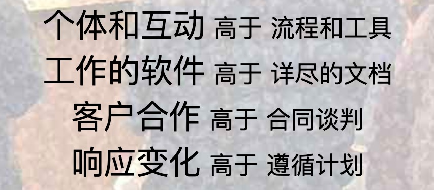
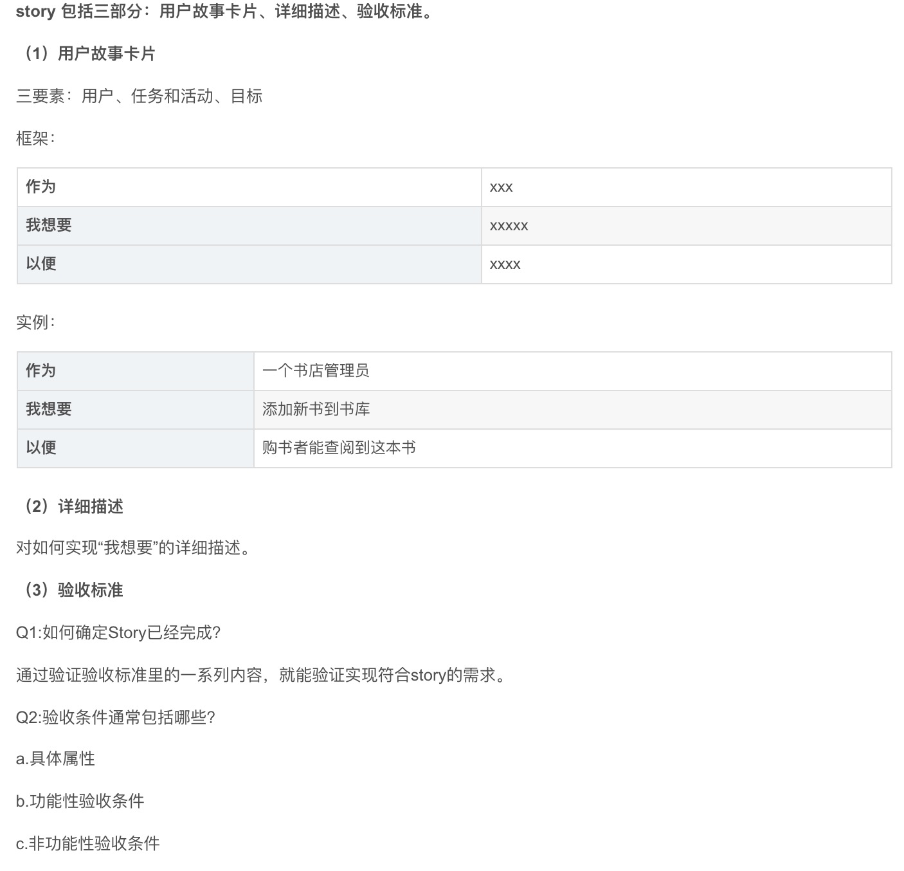

笔记内容：（100pp+）提交至github

- 知识点总结
- 课后实践任务分析
- 关键代码分析
- 收获及感想


代码：（6000+）每周至少提交一次至github

- 课堂实践
- 课后练习
- 课程项目


# 个人web页面介绍 可随时访问

1. 一台具有公网Ip地址的服务器（云主机——CPU 内存 ip地址等）
2. 装windows/linux操作系统
3. 写index.html文件
4. 文件上传服务器
5. 安装web服务器（微软自带服务器iis），配置工作目录（主目录），文件放入工作目录。
6. 通过浏览器访问`http://ip地址/文件名`

web服务器：其他人访问服务器就会定位到工作目录。

ssh ubuntu@182.254.190.232

Lanjunzhang55*

sudo mv h1/Chaeunwoo.html  /var/www/html

http://182.254.190.232.Chaeunwoo.html

/etc/init.d/bt stop && chkconfig --del bt && rm -f /etc/init.d/bt && rm -rf /www/server/panel


如何做到清零？如何做到浏览器兼容？


# 数据库设计文档

姓名和密码加密，不能用明文。

个人信息和用户名、密码分开存储和管理，加密级也不同。


问：数据从客户端发给服务端，如何安全？

如果密码明文存储，用户登录时设置密码123456，如若丢失、破解，就不安全，所以应该存储加密后的数据。

1. 前端加密：偷偷抓数据包一分析（如果没加密）就gg。
2. 写一个JS加密函数，12345加密后再传输。不安全，因为JS脚本加密算法其实是明文的。
3. 使用HTTPS协议（非对称加密保证端对端是安全的），登录端的密码无须再次MD5加密。有人可能说后端服务器一旦被攻击，就可以得知密码了，但是一旦后端被攻击，加密与否都无所谓了，无须重复加密。

需要再次加密：

二次加密的另一个功能：确认是哪个用户传输的

用户存储密码到本地，使用cookie，所以还是需要加密。

<https://www.zhihu.com/question/25539382>

<https://www.jianshu.com/p/630c1dce4915>

MD5二次加密

wireshark抓包

加盐哈希加密：加密时混入一段“随机”字符串（盐值）再进行哈希加密。即使密码相同，如果盐值不同，那么哈希值也是不一样的。现在网站开发中主要是运用这种加密方法。

盐值：e.g.我是女王大人


**日常管理数据库设计第四组**:（日常管理数据库设计（2019.3.21）

1. isdelete: int太占空间 就只有0/1

2. username和workid重复了，第一张用户账户表可以删除。

3. 用户身份证号删除，信息太重要，不能存。
4. 

| 字段名   | 字段类型    |
| -------- | ----------- |
| username | varchar(30) |

5. `记录添加操作人 最后修改操作人`可以删除


6. 第二张表可以删除，登录学校系统就不需要存用户信息。

不能删，管理员需要管理用户类型，院领导、部门领导、系领导、普通用户等。

7. 需求模糊，为什么要分这么多领导类型？

8. 地点表和默认地点表合并在一起？

9. 默认地点表什么时候使用：每周向用户发送邀请填写日程，此时系统会自动生成一个默认地点。


**华为软件开发云讲座**

Story描述了对系统或软件的客户或用户有价值的功能片段

user story 定义：

Story就是一个可测试的小功能点（Story：功能点=1：1）、或者是多个继承性的小功能点组成的一个Story（Story：功能点=1:N）、或者是一个无法再分割的功能点（再分割这个功能点就无法进行测试了）包含多个Story（Story：功能点=N：1）。


**怎么描述？**

1. As a 【user role】 
2. I want 【result】
3. So that 【reason/benefit】





3C原则

简短card 交流conversation 确认confirmation

Acceptance Criteria

- Given（在什么样的情景或条件下）
- When（做了什么操作 采取了什么行动）
- Then（得到了什么结果）


**一个好的story-INVEST属性**

- Independent
- Negotiable
- Valuable
- Estimate
- Small
- Testable


**Feature和story区别**

- feature外部可感知的，story未必;
- feature一般是迭代的，story在一个迭代内完成；
- feature针对多角色、多维度、多场景的功能描述、story需要关注一个具体角色和场景;
- feature可以是跨团队的，story一般内部和团队内部;
- feature一般不从具体的用户描述，更抽象，价值更大。


支持图书管理系统的用户信息管理和应用

图书管理系统的基础模块，在线管理用户信息，解决登录验证特性开发诉求，方便用火狐账号生成、查找，冻结，提升用户管理效率。


验收点：

支持用户账号生成

支持用户登录

支持用户账号信息录入

支持用户检索

支持用户


作为一名学生，我想用学号和密码进行登录，想要一个记忆功能。


验收点：

超过5次冻结

响应时间不能超过3秒

输入错误提示


相对估算法

故事点：

抽象的单位

对用户故事规模的相对度量，代表多少工作量并不重要。

只关注需求本身复杂度

比如登录需要1个point注册需要3个point


估算原则

- 一致的假设
- 独立投票
- 选择最大估算值
- 一致胜过精确


《没有银弹》《人月神话》软件工程的根本和次要的问题

- 复杂性 计算步骤
- 隐匿性
- 配合性
- 易变性


## 日程管理系统开发安全技术

**不要相信用户 不要相信前端校验**


输入校验：前端后端都要设置

前端：拦截合法用户

后端：拦截恶意用户


用户名输入非法字符：

SQL注入攻击：`=` ，`'`等都会干扰查询甚至报错

> SQL注入指的是在请求参数中插入一些SQL语句，程序在接受后错误地将攻击者的输入作为查询语句的一部分执行，从而欺骗服务器，执行恶意SQL命令。
>
> SQL注入可以用来从数据库获取敏感信息，或者利用数据库的特性执行添加用户，导出文件等一系列恶意操作，甚至可能获取数据库乃至系统用户最高权限。

比如查询：

```
strSQL = "SELECT * FROM users WHERE name = '" + userName + "' and pw = '"+ passWord +"';"
```

如果用户输入如下：

```
userName = "1' OR '1'='1";
passWord = "1' OR '1'='1";
```

SQL就变成

```
strSQL = "SELECT * FROM users WHERE name = '1' OR '1'='1' and pw = '1' OR '1'='1';"
```

因为where条件恒为真，这就相当于执行

```
strSQL = "SELECT * FROM users;"
```

因此，可以无账号密码登录系统。如果填入

```
userName = "1";
passWord = " '; DROP TABLE users;";
```

SQL语句则变成了

```
strSQL = "SELECT * FROM users WHERE name = '1' and pw = ' '; DROP TABLE users;"
```

这样一来，虽然没有登录，但是数据表都被删除了。

乌云：北大系统修复方案： 

```
$id = inval($_GET('id');
```


1容易被设置成超级管理员id

可设置超级管理员id为9999


用户频繁提交：可能导致应用程序上逻辑错误

检测到用户一秒钟频繁提交5次，封ip5分钟。

1. 点击按键后button暂停5秒——前端容易被绕过

2. web服务器的日志accesslog ——爬虫用User-Agent代理换ip即可
3. 每次请求加验证码——比较好


安全审计：记录用户安全操作并审核用户操作安全与否(非法用户入侵、合法用户误操作)


**认证：**

使用验证码的目的是为了阻止攻击者使用自动登录工具连续尝试登陆。

用户体验：

前3次登录尝试中不使用验证码，3次登录失败后必须使用验证码。


认证失败不能提示给用户详细、明确的错误原因，只能给出一般性的提示——防止暴力破解 字典法


**cookie Session区别：**

1. HTTP协议是无状态的协议？

   HTTP协议最初是无状态的，但是无状态的HTTP无法满足互联网日益发展的需求，于是业界拓展了HTTP协议，增加了有状态（stateful）协议头，使之变成有状态协议。有状态的协议头是依靠Cookie实现的，Cookie是维系客户端和服务器之间状态同步的纽带。状态同步就是记忆同步，也就是Keep in the same page。无论什么类型的cookie，都是由服务器一手创建，最终解释权归服务器，只有服务器才能理解这些cookie所代表的真正涵义。

2. cookie和session分别存在什么地方？

3. 保存session的方法？

4. cookie什么时间被发送服务器？

5. cookie和session能保存多长时间？ 

   session 缺省30min——

6. cookie内容可以被篡改吗？

7. 如何实现永久登录的功能？

   

Session是另一种记录客户状态的机制，不同的是Cookie保存在**客户端**浏览器中，而Session保存在**服务器**上。客户端浏览器访问服务器的时候，服务器把客户端信息以某种形式记录在服务器上。这就是Session。客户端浏览器再次访问时只需要从该Session中查找该客户的状态就可以了。

如果说Cookie机制是通过检查客户身上的“通行证”来确定客户身份的话，那么Session机制就是通过检查服务器上的“客户明细表”来确认客户身份。Session相当于程序在服务器上建立的一份客户档案，客户来访的时候只需要查询客户档案表就可以了。


**如何实现"记住我”的功能？**

一年免登录的最优方案：既安全又占用较少资源

方案一：Session缺省为30min，通过改配置改为一年，但是会占用后台资源。（Cookie：仅占用客户端资源）

不安全，Cookie可以被篡改，比如用户名root——得加密。(进入)


> 用户正在写邮件，30minsession后失效，刷新后跳转到登录界面，用户崩溃。

登陆完后将用户信息存入session, cookie，30min后session失效，传入cookie，在cookie里寻找用户名，如果有，则用用户名构造新的30分钟的session。

不安全，伪造他人cookie，即可登录。

如何使用cookie实现永久登录？


RBAC功能：用户管理、角色管理、权限管理


**字节跳动**

产品经理：感性理性结合

技术文档：技术背景 国际化-翻译能力

没有专门的技术文档工程师，工程师最了解。


分类：

- 用户产品
- 策略产品：后端
- 商业产品：营销


create-react-app 一键创建react应用

React中，render函数渲染jsx编译成html,

通过Props传递信息

- 从父组件接受的 props
- 组件内部，自己的东西 -state 


不管是否捕获、处理与否，事情都会产生。

setState

