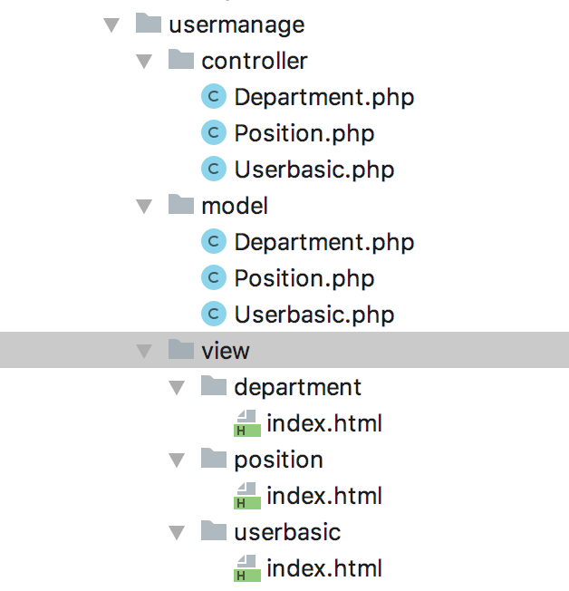

# THINKPHP开发技术

## 用宝塔搭建云端php运行环境

安装centos linux面板6.9 

`yum install -y wget && wget -O install.sh http://download.bt.cn/install/install_6.0.sh && sh install.sh`

开放8888端口

`配置安全组——放通22，80，443，3389，8888端口和ICMP协议`


登录宝塔

```
Bt-Panel: <http://172.81.252.231:8888/e20a1150>
username: xuu37vaa
password: e0dff1f2
```


下载LNMP套件


Mysql：5.5

PHP：5.6

Nginx 1.15

下载一键部署源码 

安装Thinkphp框架5.0.24


```
http://172.81.252.231/index.php/index/index/index
ip/php文件/模块/控制器/方法
```

（thinkphp关键：module/controller/action）


/指向public


## MVC

Module模块下分别有MVC

```
controller业务逻辑
model访问数据库 文件名和类名一致，所有单词首字母大写
view视图
```

public: 对外公开目录

controller下的文件名(首字母大写)和view下的文件夹名(小写)要一致



`return $this->fetch('index')` 渲染视图，展示页面(从数据库中取出来的值展示出来)

## Phpstorm连接FTP

宝塔配置

1. 添加站点


2. 修改网站目录


3. 添加FTP


4. Tools - Deployment - configuration,配置host, username, pwd后`test connection`

`root path`：同步的服务器目录

Tools – Deployment – Broswse Remote Host 可以看到远程的文件


sspku日程管理系统链接地址：

<http://172.81.252.231/ss_calendar_new/public/index.php/usermanage/position/index>


public/index.php**

```
<?php
// +----------------------------------------------------------------------
// | ThinkPHP [ WE CAN DO IT JUST THINK ]
// +----------------------------------------------------------------------
// | Copyright (c) 2006-2016 http://thinkphp.cn All rights reserved.
// +----------------------------------------------------------------------
// | Licensed ( http://www.apache.org/licenses/LICENSE-2.0 )
// +----------------------------------------------------------------------
// | Author: liu21st <liu21st@gmail.com>
// +----------------------------------------------------------------------
// [ 应用入口文件 ]

// 定义应用目录
define('APP_PATH', __DIR__ . '/../application/');

// 加载框架引导文件
require __DIR__ . '/../thinkphp/start.php';
```

## 搭建本地php运行环境

配置XAMPP

按`command + 空格键`输入 /private/etc 路径，找到etc 目录中的hosts文件，把hosts文件拖到sublime编辑器中进行编辑，添加虚拟的域名。(PS:添加了www.job,.com和api.job.com)。


在桌面上新建www文件夹，并在该文件夹中分别新建job和api文件夹，同时分别在这两个文件夹中新建index.html（或者index.php文件），在index.html中写入”hello world” 作为测试。

打开应用程序目录，找到XAMPP目录，从该目录中找etc/httpd.conf文件，把该文件拖到sublime中进行编辑。

按`command + F`输入Directory ，然后编辑和添加以下代码。


然后继续在该文件中搜索 vhosts,去掉那一行的注释，然后保存该文件，到此，httpd.conf文件就编辑完成了。


接着，打开extra 目录，找到 httpd-vhosts.conf 文件，把该文件也拖到sublime中进行编辑,修改为以下以下代码，然后保存该文件。


此时重启xampp软件。

在浏览器输入我们配置好的虚拟域名，出现了hello world ，表示我们就已经配置成功。

**报错**

输入虚拟域名www.job.com和api.job.com没有出现hello world。

修改路径仍然没有解决


```
xampp的apache无法启动
sudo /Applications/XAMPP/xamppfiles/bin/apachectl start
```


## Story实现代码

- Thinkphp日志记录在`\ThinkPHP\Lib\Think\Core\Log.class.php`或者`runtime\logs`里(后者√)

**controller/position.php**

```
<?php

namespace app\usermanage\controller;
use app\common\controller\Common;

class Position extends Common
{
		//显示列表
    public function index()
    {
        $position = model('Position');
        $list = $position->getUserPositionList();
        //dump($list);
        //exit;
        $this->assign("position_list", $list);
        return $this->fetch();
    }
    public function loadPosition()
    {
        $position = model('Position');
        $positions = $position->getUserPositionList();
        return $positions;
    }
    //作废职位
    public function invalid($user_id)
    {
        $position = model('Position');
        $position->invalid($user_id);
        $this->redirect('usermanage/position/index');
    }
		//恢复职位
    public function restore($user_id)
    {
        $position = model('Position');
        $position->restore($user_id);
        $this->redirect('usermanage/position/index');
    }
    //添加职位
    public function addPosition()
    {
        $name = $_POST['name'];
        $model = model('Position');
        $result = $model->insertPosition($name);
        if ($result == 1) {
            //设置成功后跳转页面的地址
            $this->success('新增成功', 'usermanage/position/index');
        } else {
            $this->error('新增失败');
        }
    }
    //修改职位
    public function change($id, $name)
    {
        $position = model('Position');
        return $position->change($id, $name);
    }
}
```

**model/position.php**

更新数据表中的数据

<https://www.kancloud.cn/manual/thinkphp5/135178>

```
<?php

namespace app\usermanage\model;
use think\Model;
use think\Db;

class Position extends Model
{
    //绑定表名
    protected $table = 'user_positions';
    protected $pk = 'id';//默认主键为id,如果没有使用id作为主键名，需要在模型中设置属性。
    protected $name = 'name';
    //显示列表
    public function getUserPositionList()
    {
        $list = Db::table('user_position')->select();
        return $list;
    }
    //修改职位
    public function change($id, $name)
    {
        Db::table('user_position')
            ->where('id', $id)
            ->update(['name' => $name]);
        return $name;
    }
    //作废职位
    function invalid($user_id)
    {
        $data = array();
        $data['is_delete'] = 1;
        $data['delete_time'] = Db::raw('now()');
        Db::table('user_position')->where('id', $user_id)->update($data);
    }
		//恢复职位
    function restore($user_id)
    {
        $data = array();
        $data['is_delete'] = 0;
        $data['delete_time'] = Db::raw('now()');
        Db::table('user_position')->where('id', $user_id)->update($data);
    }
    //添加职位
    public function insertPosition($name)
    {
        $data = ['name' => $name, 'is_delete' => 0];
        $result = Db::name('user_position')->insert($data);
        return $result;
    }
}
```

**view/position/index.html**

```
{volist name="position_list" id="vo"}

<tr>

	<td class="serial">{$vo.id}</td>
	<td><span class="product {$vo.id}">{$vo.name}</span></td>
	<td><span class="product">{eq name="vo.is_delete" value="0"}正常{else/}已作废{/eq}</span></td>
	
	<td>	
  		//前端界面上得到的值为vo.id，绑定在button上，就可以在js处调用
			<button type="button" class="btn btn-primary btn-sm mb-1" data-toggle="modal" data-target="#smallmodal" id="{$vo.id}" onclick="recordId(this)">
					<i class="fa fa-magic"></i>&nbsp;编辑
			</button>
			
			{eq name="vo.is_delete" value="0"}
			<a href="{:url('/usermanage/position/invalid','user_id='.$vo.id);}">
	<button type="button" class="btn btn-danger btn-sm mb-1">
			<i class="fa fa-exclamation"></i>&nbsp;作废
	</button>
			</a>{else/}<a href="{:url('/usermanage/position/restore','user_id='.$vo.id);}">
			<button type="button" class="btn btn-success btn-sm mb-1">
					<i class="fa fa-exclamation"></i>&nbsp;恢复
			</button>
			</a>{/eq}
			
	</td>
	
</tr>

{/volist}
```

**{volist}标签**
通常用于查询数据集(select方法)的结果输出，模型的select方法返回的结果是一个二维数组，可以直接使用volist标签进行输出。

```
<volist name="position_list" id="vo">
{$vo.id}:{$vo.name}<br/>
</volist>
```

name属性表示模板赋值的变量名称，因此不可以随便在模板文件中改变。id表示当前的循环变量，可以随意指定，但确保不要和name属性冲突。

```
<div class="modal fade" id="smallmodal" tabindex="-1" role="dialog" aria-labelledby="smallmodalLabel1"
     aria-hidden="true">
    <div class="modal-dialog modal-sm" role="document">
        <div class="modal-content">
            <div class="modal-header">
                <h5 class="modal-title" id="scrollmodalLabel1">编辑职位</h5>
                <button type="button" class="close" data-dismiss="modal" aria-label="Close">
                    <span aria-hidden="true">&times;</span>
                </button>
                <input hidden id="tmp_id">
            </div>
            <div class="modal-body">
                <!--<div class="form-group">
                    <div class="input-group">
                        <div class="input-group-addon">
                            <i class="fa fa-check-square-o"></i>
                        </div>
                        <input type="text" class="form-control" disabled="disabled">
                    </div>
                  </div>-->
                <div class="form-group">
                    <div class="input-group">
                        <div class="input-group-addon">
                            <i class="fa fa-pencil-square-o"></i>
                        </div>
                        <input type="text" id="position_name" class="form-control">
                    </div>
                </div>
                <div class="modal-footer">
                    <button type="button" class="btn btn-secondary" data-dismiss="modal">取消</button>
                    <button type="button" class="btn btn-success" onclick="changePositionName()">确认</button>
                </div>
            </div>
        </div>
    </div>
</div>
```

```
function changePositionName() {
    var id = $("#tmp_id").attr('id_memory');
    var name = $('#position_name').val();
    //.attr(...) is only getting the objects value at the start (when the html is created). val() is getting the object's property value which can change many times.
    val()可以取到输入文本框中的value值，.attr可以取到html元素中设置的属性value的值，不能获取动态的、输入文本框的值
    
    //用AJAX方式访问后台写的方法
    $.ajax({
        type: "POST",//使用HTTP POST请求从服务器加载数据
        url: 'change',//发送请求的url,默认是当前页面
        async: false,//请求是否异步处理，默认是true,这里设置为同步：当有返回值以后才会运行后面的js程序。
        data: {
           	"id": id,            "name": name
        },//要发送到服务器的数据
        success: function (msg) {//请求成功后调用的函数
        		window.location.reload()//忽略缓存 强制刷新页面
        },
        fail: function (msg) {//请求失败后调用的函数
            console.log(msg);//通过console打印出来
        }
        });
    }
```

**jQuery-AJAX get()和post()方法**

- GET - 从指定的资源请求数据

  GET 基本上用于从服务器获得（取回）数据。Note：GET 方法可能返回缓存数据。

- POST - 向指定的资源提交要处理的数据

  POST 也可用于从服务器获取数据。不过，POST 方法不会缓存数据，并且常用于连同请求一起发送数据。

**jQuery $.get() 方法**

$.get() 方法通过 HTTP GET 请求从服务器上请求数据。

语法：

 `$.get(URL,callback);`
 必需的 URL 参数规定希望请求的 URL。
 可选的 callback 参数是请求成功后所执行的函数名。
 下面的例子使用 $.get() 方法从服务器上的一个文件中取回数据：

```
$("button").click(function(){
  $.get("demo_test.asp",function(data,status){
    alert("Data: " + data + "\nStatus: " + status);
  });
});
```

$.get() 的第一个参数是我们希望请求的 URL（"demo_test.asp"），第二个参数是回调函数。第一个回调参数存有被请求页面的内容，第二个回调参数存有请求的状态。
 提示：这个 ASP 文件 ("demo_test.asp") 类似这样：

```
<%
response.write("This is some text from an external ASP file.")
```

**jQuery $.post() 方法**

$.post() 方法通过 HTTP POST 请求从服务器上请求数据。

语法：
 `$.post(URL,data,callback);`
 必需的 URL 参数规定希望请求的 URL。
 可选的 data 参数规定连同请求发送的数据。
 可选的 callback 参数是请求成功后所执行的函数名。
 下面的例子使用 $.post() 连同请求一起发送数据：

```
$("button").click(function(){
  $.post("demo_test_post.asp",
  {
    name:"Donald Duck",
    city:"Duckburg"
  },
  function(data,status){
    alert("Data: " + data + "\nStatus: " + status);
  });
});
```

$.post() 的第一个参数是希望请求的 URL ("demo_test_post.asp")。然后我们连同请求（name 和 city）一起发送数据。 "demo_test_post.asp" 中的 ASP 脚本读取这些参数，对它们进行处理，然后返回结果。第三个参数是回调函数。第一个回调参数存有被请求页面的内容，而第二个参数存有请求的状态。
**提示：**这个 ASP 文件 ("demo_test_post.asp") 类似这样：

```
<%
dim fname,city
fname=Request.Form("name")
city=Request.Form("city")
Response.Write("Dear " & fname & ". ")
Response.Write("Hope you live well in " & city & ".")
%>
```

**参考资料**

[Thinkphp5 系统登录的实现](<https://blog.csdn.net/amberom/article/details/78919693>)

[XAMPP安装和配置(for mac)](<https://blog.csdn.net/it_cgq/article/details/79430511>)

[jQuery AJAX 方法](<http://www.runoob.com/jquery/jquery-ref-ajax.html>)

[jQuery - AJAX get() 和 post() 方法](<https://www.jianshu.com/p/2b32d3f3e40c>)