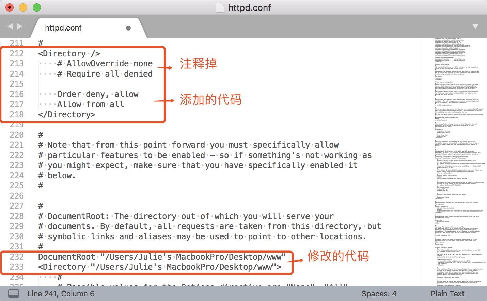
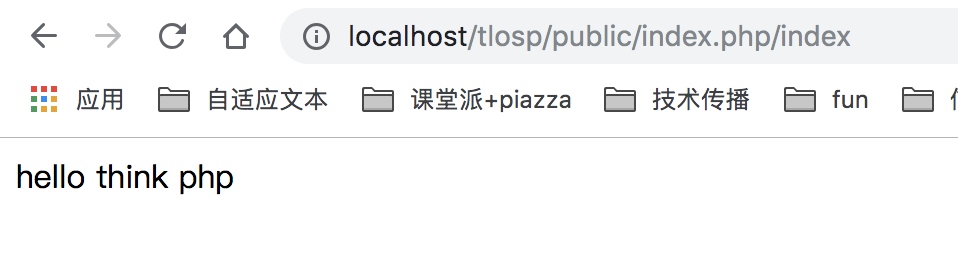

[TOC]

# THINKPHP开发技术

## MVC

Module模块下分别有MVC

```
controller业务逻辑
model访问数据库 文件名和类名一致，所有单词首字母大写
view视图
```

public: 对外公开目录

controller下的文件名(首字母大写)和view下的文件夹名(小写)要一致


`return $this->fetch('index')` 渲染视图，展示页面(从数据库中取出来的值展示出来)

## 用宝塔搭建云端php运行环境

安装centos linux面板6.9 

`yum install -y wget && wget -O install.sh http://download.bt.cn/install/install_6.0.sh && sh install.sh`

开放8888端口

`配置安全组——放通22，80，443，3389，8888端口和ICMP协议`


登录宝塔

```
Bt-Panel: <http://172.81.252.231:8888/e20a1150>
username: xuu37vaa
password: e0dff1f2
```


下载LNMP套件


Mysql：5.5

PHP：5.6

Nginx 1.15

下载一键部署源码 

安装Thinkphp框架5.0.24


```
http://172.81.252.231/index.php/index/index/index
ip/php文件/模块/控制器/方法
```

（thinkphp关键：module/controller/action）


/指向public


### Phpstorm连接FTP

宝塔配置

1. 添加站点


2. 修改网站目录


3. 添加FTP


4. Tools - Deployment - configuration,配置host, username, pwd后`test connection`

`root path`：同步的服务器目录

Tools – Deployment – Broswse Remote Host 可以看到远程的文件


sspku日程管理系统链接地址：

<http://172.81.252.231/ss_calendar_new/public/index.php/usermanage/position/index>


**public/index.php**

```
<?php
// +----------------------------------------------------------------------
// | ThinkPHP [ WE CAN DO IT JUST THINK ]
// +----------------------------------------------------------------------
// | Copyright (c) 2006-2016 http://thinkphp.cn All rights reserved.
// +----------------------------------------------------------------------
// | Licensed ( http://www.apache.org/licenses/LICENSE-2.0 )
// +----------------------------------------------------------------------
// | Author: liu21st <liu21st@gmail.com>
// +----------------------------------------------------------------------
// [ 应用入口文件 ]

// 定义应用目录
define('APP_PATH', __DIR__ . '/../application/');

// 加载框架引导文件
require __DIR__ . '/../thinkphp/start.php';
```

## 搭建本地php运行环境

使用MAMP更加丝滑，可随意切换版本，一键启动。

使用uninstaller卸载XAMPP，再`sudo rm -rf /Applications/xampp`删除缓存文件。

### 配置MAMP

灰色大象图标——preferences——ports一步即可


端口默认的8888，那么每次访问站点都需要加上8888，比如http://localhost:8888/，如果把端口改为80，在访问站点的时候，就可以不用输入端口号了。

**配置PHPSTORM**

create new project选择路径，preferences——languages and frameworks设置CLI interpreter为php5.6。


接下来配置servers, Host处填写MAMP里创建的根路径。


再打开MAMP——bin——php——php5.6.32——conf——php.ini文件，删掉最后一行的#号。


输入<http://localhost/ss_calendar_new/public/index.php/usermanage/position/index>即可访问


### 配置XAMPP(未成功)

按`command + 空格键`输入 /private/etc 路径，找到etc 目录中的hosts文件，把hosts文件拖到sublime编辑器中进行编辑，添加虚拟的域名。(PS:添加了www.job,.com和api.job.com)。


在桌面上新建www文件夹，并在该文件夹中分别新建job和api文件夹，同时分别在这两个文件夹中新建index.html（或者index.php文件），在index.html中写入”hello world” 作为测试。

打开应用程序目录，找到XAMPP目录，从该目录中找etc/httpd.conf文件，把该文件拖到sublime中进行编辑。

按`command + F`输入Directory ，然后编辑和添加以下代码。




然后继续在该文件中搜索 vhosts,去掉那一行的注释，然后保存该文件，到此，httpd.conf文件就编辑完成了。


接着，打开extra 目录，找到 httpd-vhosts.conf 文件，把该文件也拖到sublime中进行编辑,修改为以下以下代码，然后保存该文件。


此时重启xampp软件。

在浏览器输入我们配置好的虚拟域名，出现了hello world ，表示我们就已经配置成功。

#### 报错

输入虚拟域名www.job.com和api.job.com没有出现hello world。

修改路径仍然没有解决


```

```

把tlops放入**htdocs**文件夹下，输入路径`localhost/tlosp/public/index.php/index`可以显示hello think php



输入`localhost/www/job/index.html`也可以显示：


**启动xampp**

```
$ sudo su
输入密码
$ /Applications/XAMPP/xamppfiles/xampp start
停止stop
重启restart
如果xampp的apache无法启动
$ sudo /Applications/XAMPP/xamppfiles/bin/apachectl start
```


## Story实现代码

- Thinkphp日志记录在`\ThinkPHP\Lib\Think\Core\Log.class.php`或者`runtime\logs`里(后者√)

**controller/position.php**

```php
<?php

namespace app\usermanage\controller;
use app\common\controller\Common;

class Position extends Common
{
		//显示列表
    public function index()
    {
        $position = model('Position');
        $list = $position->getUserPositionList();
        //dump($list);
        //exit;
        $this->assign("position_list", $list);
        return $this->fetch();
    }
    public function loadPosition()
    {
        $position = model('Position');
        $positions = $position->getUserPositionList();
        return $positions;
    }
    //作废职位
    public function invalid($user_id)
    {
        $position = model('Position');
        $position->invalid($user_id);
        $this->redirect('usermanage/position/index');
    }
		//恢复职位
    public function restore($user_id)
    {
        $position = model('Position');
        $position->restore($user_id);
        $this->redirect('usermanage/position/index');
    }
    //添加职位
    public function addPosition()
    {
        $name = $_POST['name'];
        $model = model('Position');
        $result = $model->insertPosition($name);
        if ($result == 1) {
            //设置成功后跳转页面的地址
            $this->success('新增成功', 'usermanage/position/index');
        } else {
            $this->error('新增失败');
        }
    }
    //修改职位
    public function change($id, $name)
    {
        $position = model('Position');
        return $position->change($id, $name);
    }
}
```

**model/position.php**

更新数据表中的数据

<https://www.kancloud.cn/manual/thinkphp5/135178>

```php
<?php

namespace app\usermanage\model;
use think\Model;
use think\Db;

class Position extends Model
{
    //绑定表名
    protected $table = 'user_positions';
    protected $pk = 'id';//默认主键为id,如果没有使用id作为主键名，需要在模型中设置属性。
    protected $name = 'name';
    //显示列表
    public function getUserPositionList()
    {
        $list = Db::table('user_position')->select();
        return $list;
    }
    //修改职位
    public function change($id, $name)
    {
        Db::table('user_position')
            ->where('id', $id)
            ->update(['name' => $name]);
        return $name;
    }
    //作废职位
    function invalid($user_id)
    {
        $data = array();
        $data['is_delete'] = 1;
        $data['delete_time'] = Db::raw('now()');
        Db::table('user_position')->where('id', $user_id)->update($data);
    }
		//恢复职位
    function restore($user_id)
    {
        $data = array();
        $data['is_delete'] = 0;
        $data['delete_time'] = Db::raw('now()');
        Db::table('user_position')->where('id', $user_id)->update($data);
    }
    //添加职位
    public function insertPosition($name)
    {
        $data = ['name' => $name, 'is_delete' => 0];
        $result = Db::name('user_position')->insert($data);
        return $result;
    }
}
```

**view/position/index.html**

```php+HTML
{volist name="position_list" id="vo"}

<tr>

	<td class="serial">{$vo.id}</td>
	<td><span class="product {$vo.id}">{$vo.name}</span></td>
	<td><span class="product">{eq name="vo.is_delete" value="0"}正常{else/}已作废{/eq}</span></td>
	
	<td>	
  		//前端界面上得到的值为vo.id，绑定在button上，就可以在js处调用
			<button type="button" class="btn btn-primary btn-sm mb-1" data-toggle="modal" data-target="#smallmodal" id="{$vo.id}" onclick="recordId(this)">
					<i class="fa fa-magic"></i>&nbsp;编辑
			</button>
			
			{eq name="vo.is_delete" value="0"}
			<a href="{:url('/usermanage/position/invalid','user_id='.$vo.id);}">
	<button type="button" class="btn btn-danger btn-sm mb-1">
			<i class="fa fa-exclamation"></i>&nbsp;作废
	</button>
			</a>{else/}<a href="{:url('/usermanage/position/restore','user_id='.$vo.id);}">
			<button type="button" class="btn btn-success btn-sm mb-1">
					<i class="fa fa-exclamation"></i>&nbsp;恢复
			</button>
			</a>{/eq}
			
	</td>
	
</tr>

{/volist}
```

**{volist}标签**
通常用于查询数据集(select方法)的结果输出，模型的select方法返回的结果是一个二维数组，可以直接使用volist标签进行输出。

```php+HTML
<volist name="position_list" id="vo">
{$vo.id}:{$vo.name}<br/>
</volist>
```

name属性表示模板赋值的变量名称，因此不可以随便在模板文件中改变。id表示当前的循环变量，可以随意指定，但确保不要和name属性冲突。

```php+HTML
<div class="modal fade" id="smallmodal" tabindex="-1" role="dialog" aria-labelledby="smallmodalLabel1"
     aria-hidden="true">
    <div class="modal-dialog modal-sm" role="document">
        <div class="modal-content">
            <div class="modal-header">
                <h5 class="modal-title" id="scrollmodalLabel1">编辑职位</h5>
                <button type="button" class="close" data-dismiss="modal" aria-label="Close">
                    <span aria-hidden="true">&times;</span>
                </button>
                <input hidden id="tmp_id">
            </div>
            <div class="modal-body">
                <!--<div class="form-group">
                    <div class="input-group">
                        <div class="input-group-addon">
                            <i class="fa fa-check-square-o"></i>
                        </div>
                        <input type="text" class="form-control" disabled="disabled">
                    </div>
                  </div>-->
                <div class="form-group">
                    <div class="input-group">
                        <div class="input-group-addon">
                            <i class="fa fa-pencil-square-o"></i>
                        </div>
                        <input type="text" id="position_name" class="form-control">
                    </div>
                </div>
                <div class="modal-footer">
                    <button type="button" class="btn btn-secondary" data-dismiss="modal">取消</button>
                    <button type="button" class="btn btn-success" onclick="changePositionName()">确认</button>
                </div>
            </div>
        </div>
    </div>
</div>
```

```php+HTML
function changePositionName() {
    var id = $("#tmp_id").attr('id_memory');
    var name = $('#position_name').val();
    //.attr(...) is only getting the objects value at the start (when the html is created). val() is getting the object's property value which can change many times.
    val()可以取到输入文本框中的value值，.attr可以取到html元素中设置的属性value的值，不能获取动态的、输入文本框的值
    
    //用AJAX方式访问后台写的方法
    $.ajax({
        type: "POST",//使用HTTP POST请求从服务器加载数据
        url: 'change',//发送请求的url,默认是当前页面
        async: false,//请求是否异步处理，默认是true,这里设置为同步：当有返回值以后才会运行后面的js程序。
        data: {
           	"id": id,            "name": name
        },//要发送到服务器的数据
        success: function (msg) {//请求成功后调用的函数
        		window.location.reload()//忽略缓存 强制刷新页面
        },
        fail: function (msg) {//请求失败后调用的函数
            console.log(msg);//通过console打印出来
        }
        });
    }
```

### jQuery-AJAX get()和post()方法

- GET - 从指定的资源请求数据

  GET 基本上用于从服务器获得（取回）数据。Note：GET 方法可能返回缓存数据。

- POST - 向指定的资源提交要处理的数据

  POST 也可用于从服务器获取数据。不过，POST 方法不会缓存数据，并且常用于连同请求一起发送数据。

**jQuery $.get() 方法**

$.get() 方法通过 HTTP GET 请求从服务器上请求数据。

语法：

 `$.get(URL,callback);`
 必需的 URL 参数规定希望请求的 URL。
 可选的 callback 参数是请求成功后所执行的函数名。
 下面的例子使用 $.get() 方法从服务器上的一个文件中取回数据：

```html
$("button").click(function(){
  $.get("demo_test.asp",function(data,status){
    alert("Data: " + data + "\nStatus: " + status);
  });
});
```

$.get() 的第一个参数是我们希望请求的 URL（"demo_test.asp"），第二个参数是回调函数。第一个回调参数存有被请求页面的内容，第二个回调参数存有请求的状态。
 提示：这个 ASP 文件 ("demo_test.asp") 类似这样：

```
<%
response.write("This is some text from an external ASP file.")
```

**jQuery $.post() 方法**

$.post() 方法通过 HTTP POST 请求从服务器上请求数据。

语法：
 `$.post(URL,data,callback);`
 必需的 URL 参数规定希望请求的 URL。
 可选的 data 参数规定连同请求发送的数据。
 可选的 callback 参数是请求成功后所执行的函数名。
 下面的例子使用 $.post() 连同请求一起发送数据：

```
$("button").click(function(){
  $.post("demo_test_post.asp",
  {
    name:"Donald Duck",
    city:"Duckburg"
  },
  function(data,status){
    alert("Data: " + data + "\nStatus: " + status);
  });
});
```

$.post() 的第一个参数是希望请求的 URL ("demo_test_post.asp")。然后我们连同请求（name 和 city）一起发送数据。 "demo_test_post.asp" 中的 ASP 脚本读取这些参数，对它们进行处理，然后返回结果。第三个参数是回调函数。第一个回调参数存有被请求页面的内容，而第二个参数存有请求的状态。
**提示：**这个 ASP 文件 ("demo_test_post.asp") 类似这样：

```
<%
dim fname,city
fname=Request.Form("name")
city=Request.Form("city")
Response.Write("Dear " & fname & ". ")
Response.Write("Hope you live well in " & city & ".")
%>
```


## 调试BUG

返回一个json格式的字符串

```php
return $position->change($id, $name);
```

==返回一个模型==


#### 1. 点击`编辑职位`，控制台出现`omg is not defined`或`id is not defined`,`haole is not defined`

在function *changePositionName*()的ajax前面打印id和name

```php
function changePositionName(){
		console.log(id, name);
		$.ajax({
		略
		})
}
```

点击`编辑`之后控制台显示`undefined "院长"`，说明id没有拿到，检查`编辑`按钮的html

```html
<button type="button" class="btn btn-primary btn-sm mb-1" data-toggle="modal" data-target="#smallmodal" onclick="setData(2, haole)">
```

点击`编辑`职位时，输入框中已存在职位名称。可知是因为function *loadTable*()处`onmouseenter="setData(${item.id}, '${item.name}')"`中`'${item.name}'`缺少引号。修改后控制台显示`2 院长`，成功！

```php
`<tr>
    <td class="serial">${i + 1}</td>
    <td class="product">${item.name}</td>
    <td class="product">${note[item.is_delete]}</td>
    <td>
   			<button type="button"
        	id="edit${item.id}"
        	class="btn btn-primary btn-sm mb-1"
        	onmouseenter="setData(${item.id}, '${item.name}')">
        	<i class="fa fa-magic"></i>&nbsp;编辑
        </button>&nbsp;&nbsp;&nbsp;&nbsp;
        
        <button type="button"
         		class="btn btn-danger btn-sm mb-1"
         		onclick="invalid(${item.id})">
         		<i class="fa fa-exclamation"/>&nbsp;删除
        </button>
     </td>
</tr>`;
```


#### 2. 添加职位后类型显示`undefined`，而不是`未删除`。

function *loadTable*()处，将`{note[item]}`改为`{note[item.is_delete]}`

修改后，可显示`已删除`和`未删除`

```php
success: function (data) {
    var table_html = "";
    var note = ["未删除", "已删除"];
    for (var i = 0; i < data.length; i++) {
        var item = data[i]
				if (item.is_delete) {
    				table_html += `<tr class="deleted">
                        			 <td class="serial">${i + 1}</td>
                        			 <td class="product">${item.name}</td>
                        			 <td class="product">${note[item.is_delete]}</td>
                        		   <td>
                        					<button type="button"            																																		onclick="recoverPosition(${item.id})"
                                					class="btn btn-recover btn-sm mb-1" >
                                					<i class="fa fa-rotate-left"/>&nbsp;恢复
                        					</button>
                        				</td>
                     			</tr>`;
				} else {
    				table_html += `<tr>
                       					<td class="serial">${i + 1}</td>
                      					<td class="product">${item.name}</td>
                   		 					<td class="product">${note[item.is_delete]}</td>
                   		 					<td>
                                    <button type="button" 
                                    				id="edit${item.id}"
                                    				class="btn btn-primary btn-sm mb-1"
                                    				onmouseenter="setData(${item.id}, '${item.name}')">
                                    				<i class="fa fa-magic"></i>&nbsp;编辑
                                    </button>&nbsp;&nbsp;&nbsp;&nbsp;
                                    <button type="button"
                                            class="btn btn-danger btn-sm mb-1"
                                            onclick="invalid(${item.id})">
                                            <i class="fa fa-exclamation"/>&nbsp;删除
                                    </button>
                                </td>
                            </tr>`;
```

#### 3. 对用户输入进行检查，但是输入汉字却弹出提示"职位名称中不能包含标点符号"

````php
 public function change($id, $name)
    {
        if (Position::get(['name' => $name])) {
            //如果在表中查询到该用户名,数据库中0表示存在，1表示已删除
            $status = 0;
            $message = '职位已存在,请重新输入';
            return ['status' => $status, 'message' => $message];
        }
        if(empty($name)){
            //如果输入的职位名称为空
            $message = '职位名称不能为空';
            return ['message' => $message];
        }
        if(strlen($name) > 30){
            //如果职位名称大于30个字符
            $message = '职位名称不能大于30个字符';
            return ['message' => $message];
        }
        if(preg_match(pattern:'[\s\p{p}\n\r=+$￥<>^`~|]',$name)){
            #如果输入包含标点符号字符
            $message = '职位名称中不能包含标点符号';
            return ['message' => $message];
        }
        $user = model(name: 'Position');
        $user->data([
        		'id' => $id,
        		'name' => $name,
        		'is_delete' => 0
        ]);
        $user->save();
        $status = 1;
        $message = "编辑成功"；
        return ['status' => $status, 'message' => $message];
````

经查，可能是与编码有关系，php中utf-8编码下用正则表达式匹配**汉字**的表达式应为``/^[\x{4e00}-\x{9fa5}]+$/u,``，若要匹配只能是**汉字数字字母**三者之中的字符，表达式应为`/^[a-zA-Z0-9_\x{4e00}-\x{9fa5}]{6,16}$/u`

**Note:** `^`和`$`匹配字符串开头和结尾，`/u`表示按照utf-8匹配

修改之后：

```PHP
if(!preg_match('/^[\x{4e00}-\x{9fa5}A-Za-z0-9_]+$/u',$name)){
    #如果输入包含标点符号字符
    $message = '职位名称中不能包含标点符号';
    return ['message' => $message];
```

#### 4. 可以实现判断是否为空，是否包含标点符号，是否重复，但是没法编辑，点击确认之后报错post 500 internal server error

内部服务器错误——查看服务器项目日志

htdocs—ss_calendar_new—runtime—log—201905—19.log

```
[ error ] [10501]SQLSTATE[23000]: Integrity constraint violation: 1062 Duplicate entry '2' for key 'PRIMARY'[/Applications/MAMP/htdocs/ss_calendar_new0/thinkphp/library/think/db/Connection.php:453]
```

违反完整性约束，主键重复。


完整性约束是为了表中数据的正确性。

当某一列添加了主键约束之后，那么这一列的数据就不能重复出现。这样每行记录中其主键列的值就是这一行的唯一标识。主键列的值不能为null，也不能重复，指定主键约束使用primary key关键字。

插入数据（上）改为更新数据（下）：

```php
$user = model(name: 'Position');
				//模型对象赋值
        $user->data([
        		'id' => $id,
        		'name' => $name,
        		'is_delete' => 0
        ]);
        $user->save();
```

```php
$position = Position::get($id);
        $position->save(
            ['name' => $name],
            ['id' => $id]
        );
```

**添加一条数据**

实例化模型对象后赋值并保存：

```php
$user           = new User;
$user->name     = 'thinkphp';
$user->email    = 'thinkphp@qq.com';
$user->save();
```

也可以直接传入数据到`save`方法批量赋值：

```php
$user = new User;
$user->save([
    'name'  =>  'thinkphp',
    'email' =>  'thinkphp@qq.com'
]);
```

或者直接在实例化的时候传入数据

```php
$user = new User([
    'name'  =>  'thinkphp',
    'email' =>  'thinkphp@qq.com'
]);
$user->save();
```

**查找并更新**

在取出数据后，更改字段内容使用save方法更新数据，这种方式是最佳的更新方式。

```php
$user = User::get(1);
$user->name    = 'thinkphp';
$user->email   = 'thinkphp@qq.com';
$user->save();
```

**直接更新数据**

```php
$user = new User;
// save方法第二个参数为更新条件
$user->save([
    'name'  => 'thinkphp',
    'email' => 'thinkphp@qq.com'
],['id' => 1]);
```

#### 5. 编辑之后再次点击编辑无反应，第三次才会响应

暴力破解：window.location.reload()//忽略缓存 强制刷新页面

但是带来了新的问题：在2，3，4.……页编辑、添加成功之后页面会跳转到第一页。

#### 6. 不能翻页，不能记录条数

去掉loadtable（动态添加），改用volist(静态，需刷新)

把`<td class="serial">{$vo.id}</td>`改成`{$i}`，解决排序问题。

```php+HTML
{volist name="position_list" id="vo"}
	<tr>
  		<td class="serial">{$i}</td>
      <td><span class="product {$vo.id}">{$vo.name}</span></td>
      <td><span class="product">{eq name="vo.is_delete" value="0"}正常{else/}已作废{/eq}</span></td>
      <td>
      		{if condition="$vo.is_delete eq 1"}
          <button type="button"                                                                   							onclick="recoverPosition('{$vo.id}')"
           		class="btn btn-recover btn-sm mb-1" >
           		<i class="fa fa-rotate-left"></i>&nbsp;恢复
          </button>          
          {else /}
          <button type="button"
             	class="btn btn-primary btn-sm mb-1"
              data-toggle="modal"
              data-target="#smallmodal"                                                                         							onclick="setData('{$vo.id}', '{$vo.name}')">
              <i class="fa fa-magic"></i>&nbsp;编辑                                                                      					 </button>&nbsp;&nbsp;&nbsp;&nbsp;
          <button type="button"
              class="btn btn-danger btn-sm mb-1"                                                                               							 onclick="invalid('{$vo.id}')">
              <i class="fa fa-exclamation"></i>&nbsp;作废
          </button>
          {/if}
       </td>
	</tr>
{/volist}
```


**参考资料**

[Thinkphp5 系统登录的实现](<https://blog.csdn.net/amberom/article/details/78919693>)

[Mac 安装和使用 XAMPP(原创)](https://cnbin.github.io/blog/2015/06/05/mac-an-zhuang-he-shi-yong-xampp/>)

[macOS通过MAMP PRO搭建PHP环境](https://www.jianshu.com/p/926b18f506c4>)

[通过Mamp➕phpstorm运行PHP程序](<https://www.jianshu.com/p/e3f3e467bde9>)

[XAMPP安装和配置(for mac)](<https://blog.csdn.net/it_cgq/article/details/79430511>)

[jQuery AJAX 方法](<http://www.runoob.com/jquery/jquery-ref-ajax.html>)

[jQuery - AJAX get() 和 post() 方法](<https://www.jianshu.com/p/2b32d3f3e40c>)

[php正则匹配汉字报错](https://www.cnblogs.com/i6010/articles/4906727.html )

[php正则表达式完整图](<https://image-static.segmentfault.com/422/043/4220430408-55792af57b919>)